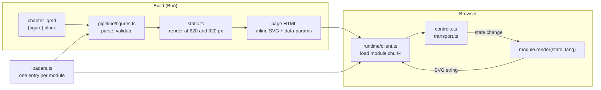

# Figure modules

A figure is one TypeScript module in this directory. It declares its
parameters, its timeline if it animates, its en and zh labels, and a pure
function that renders a state to SVG markup. The build renders the opening
state into the page as inline SVG, so the figure is visible, printable, and
indexed without script; the browser then loads the module and replaces the
static SVG with a live figure: controls, a transport for animated figures, and
a re-render at the column width on every change.

The older canvas components in `app/src/runtime/viz.ts` still work for the
figures that have not moved here. New figures are modules.



## Files

| Path | What it is |
|---|---|
| `<name>.ts` | One figure: declaration, labels, render, describe. The file name is the figure name. |
| `loaders.ts` | The registry. Add one line per figure. Each entry is a lazy import, so the client downloads a figure only on pages that embed it. |
| `index.ts` | All modules loaded eagerly, for the build and the tests. |
| `types.ts` | The module contract (`defineFigure`, parameter kinds, `State`, `Timeline`). |
| `static.ts` | Build-time render of the opening state in a desktop and a phone layout. |
| `lib/` | Shared primitives, described below. |
| `runtime/` | Client only: hydration, controls, and the motion transport. |
| `figures.test.ts` | The generic contract tests. |
| `../pipeline/figures.ts` | Parses the chapter block and emits the figure element. |

## Embedding a figure in a chapter

````markdown
```{figure}
//| figure: paged-kv-batching
//| label: fig-memory-scheduling-pressure
//| fig-cap: "The same scheduler on a 448-token pool at a higher arrival rate. ..."
rate: 0.5
pool: 448
```
````

- `//| figure:` names the module, `//| label:` gives the cross-reference id
  (`@fig-...` works as for any figure), and `//| fig-cap:` is the caption.
- Every other line is `key: value` and sets a declared parameter. `t: <n>`
  sets the opening timeline position; without it the figure opens on its
  `poster` moment.
- The en and zh blocks are identical except for the caption. The language
  comes from the build. A test fails if the two trees differ in figure names,
  labels, or parameters on any page.
- The caption is inline markdown: `$math$`, `[@citation]`, `@sec-` and `@fig-`
  references, and `@gls-` terms render as in prose.
- Unknown figures, unknown parameters, and values outside the declared range
  fail the build.

## The module shape

```ts
import { defineFigure, type Lang, type State } from "./types.ts";
import { svg, el, text } from "./lib/svg.ts";
import { C, TYPE } from "./lib/theme.ts";
import { linear } from "./lib/scale.ts";
import { axis } from "./lib/axis.ts";

const labels = {
  en: { title: "Softmax temperature", x: "token", readout: "top token {p}" },
  zh: { title: "softmax 温度", x: "词元", readout: "最高概率 {p}" },
};

type P = { temperature: number };

function describe(st: State<P>, lang: Lang): string { /* one or two sentences of the state */ }

function render(st: State<P>, lang: Lang): string {
  const L = labels[lang];
  const narrow = st.w < 480; // phone column: change the composition, not just the scale
  const x = linear([0, 8], [40, st.w - 8]);
  return svg(st.w, 240, describe(st, lang),
    axis({ scale: x, orient: "bottom", at: 200, title: L.x }),
    /* marks */);
}

export default defineFigure({
  name: "softmax-temperature",
  title: { en: labels.en.title, zh: labels.zh.title },
  labels,
  params: {
    temperature: { kind: "range", scale: "log", label: { en: "Temperature", zh: "温度" }, min: 0.1, max: 10, default: 1,
      marks: [{ value: 1, label: { en: "model", zh: "模型" } }] },
  },
  render,
  describe,
});
```

Then add `"softmax-temperature": () => import("./softmax-temperature.ts"),` to
`loaders.ts`.

### Parameters

| Kind | Declares | Control |
|---|---|---|
| `range` | `min`, `max`, `default`, optional `step`, `scale: "log"`, `unit`, `marks` | slider with value and unit |
| `choice` | `options: [{ value, label }]`, `default` | segmented buttons up to four options, a select beyond; `control: "buttons"` keeps a long list as wrapping chips, `control: "select"` forces a select |
| `toggle` | `default` | checkbox |

`control: false` hides a parameter from the page but keeps it settable from
the chapter block (a pool size, a seed). `update(p, key)` may adjust other
parameters after the reader changes one (choosing an example operation moves
the intensity slider in `roofline.ts`). All interactive state is a
parameter, including a selection, so a chapter block can open the figure on
it.

### Render rules

- **Pure.** `render(state, lang)` returns a string and reads nothing else: no
  DOM, no clock, no `Math.random`. It runs in Bun at build time and in the
  browser. Simulations draw from `lib/random.ts` with a seed parameter and
  memoize per parameter set (see `runs()` in `paged-kv-batching.ts`).
- **Width.** `state.w` is the layout width in CSS pixels and one viewBox unit
  is one pixel. The build renders at 620 (desktop column, about 614 px at a
  1280 px viewport) and 320 (phone column, about 312 px at 390 px); the live
  figure renders at the measured width. Below 480, stack panels vertically.
  The root comes from `svg(w, h, label, ...)`: a viewBox and no width.
- **Color by job, from tokens.** Use `C` from `lib/theme.ts`, never hex:
  `C.ink`, `C.ink2`, `C.ink3` for non-data ink; `C.grid`, `C.rule` for chart
  furniture; `C.panel` for empty cells and tracks; `C.c1` to `C.c8` for
  categorical identity in that fixed order (validated for color-vision
  deficiency in light and dark); `C.good`, `C.warn`, `C.bad` for status, always
  with a label. Tokens resolve in the static SVG too, so both themes work
  without script. Text never wears a series color.
- **Text.** Sizes from `TYPE` (11 px is the floor). Roles are classes:
  `fig-t-strong`, `fig-t-muted`, `fig-t-faint`, `fig-t-num` (tabular digits),
  `fig-t-halo` (a paper-colored halo for labels that sit over lines). Do not
  set `font-family`: the page's UI font applies, with its CJK fallback.
- **Ids.** Prefix every `id` (patterns, clip paths) with `state.uid`; a page
  holds the desktop and phone renders of one figure, and possibly several
  figures of the same kind.
- **Pointer shortcuts.** An element with `data-fig-set="key=value"` and class
  `fig-hit` sets that parameter on click. Every such parameter also needs a
  keyboard path: a control, or a default that already shows the answer.
- **Describe.** `describe(state, lang)` returns one or two plain sentences of
  what the figure shows at this state. It is the SVG's accessible name and what
  the live region announces after a change or a step.
- **Real data carries provenance.** Measured values live in the module with a
  comment naming the source, version, and how they were produced; a
  regeneration script goes in `tools/figure-data/` (see
  `causal-attention.ts`). Say in the caption which numbers are illustrative.

### Timelines

```ts
timeline: {
  rate: 5,          // positions per second at 1x
  discrete: true,   // render integer positions (one model iteration per step)
  duration: (p) => lastStep(p),
  keyframes: (p, lang) => events(p).map((e) => ({ t: e.t, label: label(e, lang) })),
  poster: (p) => mostInformativeStep(p),
},
```

The figure never animates itself; `runtime/transport.ts` owns time. It offers
play, pause, step back and forward, and a scrubber with a tick per keyframe,
and it shows the latest keyframe's label. Under `prefers-reduced-motion` there
is no play button and the step buttons move between keyframes. Playback
pauses when the figure leaves the viewport. The state at position `t` must be
a function of `t`, so scrubbing backward works and a screenshot can capture any
moment. `poster` is what the build renders and what the page opens on: choose
the moment that makes the point, never an empty `t = 0`.

## Primitives in `lib/`

| Module | Use it for |
|---|---|
| `svg.ts` | `svg`, `el`, `text`, `g`, `linePath`, `hatch`; colors passed as tokens are emitted as CSS so `var()` resolves |
| `scale.ts` | `linear` and `log` scales with real ticks (1-2-5 steps, decades plus minor ticks), `band` for equal cells |
| `axis.ts` | bottom and left axes with gridlines, thinned tick labels in data units, and a titled quantity |
| `labels.ts` | `textWidth` (calibrated to Chrome within about 5 percent), `placeLabels` (greedy placement with leader lines around obstacles), `lineObstacles` (keep labels off lines), `wrap` |
| `legend.ts` | a legend that wraps to the width, with rect, line, dot, and pattern swatches |
| `format.ts` | `si` (3.35 TB/s, 40.1 µs), `sig`, `fixed`, `pct`, `compact`, and `tpl` templates with `{n:block/blocks}` plurals |
| `random.ts` | seeded `rng`, `exponential`, `intBetween` |
| `theme.ts` | the color tokens `C`, `CATEGORICAL`, and the type scale `TYPE` |
| `params.ts` | defaults, validation, and chapter-block parsing (used by the pipeline and the client) |

## zh labels

- `labels.zh` must carry exactly the keys of `labels.en`; this is a type error
  otherwise. Parameter and option labels carry `{ en, zh }` pairs.
- Write the zh labels natively, following `CONVENTIONS.md`: full-width
  punctuation in Chinese text (，。：；（）), code, symbols, and math unchanged
  (`q·k / c`, `F / P`), no em dashes, and plain accurate terms from the book's
  zh chapters (词元, 预填充, 解码, 块表).
- Templates use the same placeholders in both languages; `{n:one/many}`
  plurals are for English only.
- Keep labels short enough for the 320 px layout; CJK glyphs are one em wide.

## Checklist for a new figure

1. The figure answers a question the paragraph poses, and shows the mechanism
   the prose describes, not a restatement of it.
2. One module, registered in `loaders.ts`, embedded with a `{figure}` block in
   both trees with the same parameters.
3. Parameters declared with ranges and defaults; every control changes what is
   drawn in the direction and amount the model implies.
4. Axes in data units with ticks and titles; no internal units.
5. Colors from `C` only; categorical slots in order; text in ink tokens.
6. Layout checked at 320 and 620; phone layout stacks; nothing wider than `w`.
7. Labels placed with `placeLabels` or fixed positions that cannot collide.
8. `describe` reads as a sentence in both languages.
9. Animated: pure `state(t)`, labeled keyframes, and an informative `poster`.
10. Captions in both languages, plain technical wording, no em dashes, saying
    which values are measured and which are illustrative.
11. `bun run build && bun test && bun run typecheck` pass, then look at it:
    `bun run scripts/figure-shots.ts <lang>/<chapter-path>` writes screenshots
    at 1280 and 390 px, in the dark theme, and without script, and reports
    figures that failed to hydrate, console errors, and sideways scrolling.

The tests are generic by design and do not assert what any one figure draws:
every block resolves to a module and validates, en and zh embed the same
figures with the same parameters, every module renders its opening state and
its last timeline position in both languages at both widths with a viewBox
and no fixed width, labels exist in both languages without em dashes, and the
static host carries both layouts. Add no per-figure assertions.
