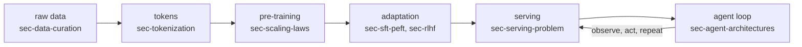

# The Whole Stack in One Pass {#sec-whole-stack}

This book is long, and the temptation is to read it as a list of unrelated
techniques. This chapter is the antidote. By the end a reader can trace one
ordinary request from raw text on the open web all the way to a deployed
agent answering it, name the layer that handles each step, and point to the
chapter that owns it. The point is orientation, not depth: every mechanism
here is a forward pointer, deliberately left for its own chapter.

## One task, end to end

Take a single task and refuse to let go of it: *a user asks an assistant to
find the bug in a small repository, propose a fix, and explain it.* That one
request touches every layer this book covers. Following it once, in order,
is the fastest way to see why the stack has the shape it does.

The task begins long before the user types it, in a corpus. The model that
will eventually read the repository learned what code looks like from
trillions of tokens scraped, filtered, and deduplicated from the web and
from public repositories. Llama 3's largest model was pre-trained on 15.6
trillion tokens; DeepSeek-V3 on 14.8 trillion. Those numbers are not the
interesting part. The interesting part is everything done to the raw bytes
before they counted as a token at all: source selection, quality filtering,
near-duplicate removal, and decontamination against the very benchmarks the
model will later be graded on. That work belongs to @sec-data-curation. The
step that turns a filtered byte stream into the integer tokens the model
actually consumes, and the vocabulary that decides how a variable name or a
Chinese sentence is split, belongs to @sec-tokenization.

With a token stream in hand, pre-training turns compute into a base model by
minimizing next-token loss. How large a model to train on how many tokens,
for a fixed budget, is the question of @sec-scaling-laws. What the network
itself is built from, attention and residual streams and normalization, is
@sec-transformer-architecture. Here the two running examples already
diverge, and the divergence is the book in miniature. Llama 3's 405B model
is a dense Transformer: every parameter participates in every token.
DeepSeek-V3 is a mixture of experts, 671B total parameters but only 37B
activated per token, paired with multi-head latent attention to shrink the
inference-time cache. That choice, dense versus sparse, is @sec-moe-ssm-hybrids.
Running either training job across thousands of accelerators without the run
diverging or the hardware idling is @sec-training-at-scale, where DeepSeek-V3's
FP8 mixed-precision recipe and its 2.788 million H800 GPU-hours of total
training live.

A base model predicts plausible continuations of text. It does not yet want
to fix your bug. Turning a next-token predictor into something that follows
instructions, refuses harmful requests, and reasons before answering is
adaptation, the second great expense after pre-training. Supervised
fine-tuning on demonstrations is @sec-sft-peft. Learning from human or
automated preference signals, by reward modeling and policy optimization or
by the direct-preference family that skips the explicit reward model, is
@sec-rlhf and @sec-dpo-variants. Teaching a model to spend tokens thinking
before it commits to an answer, the capability that separates a 2025
reasoning model from a 2023 chat model, is @sec-training-to-reason.

Now the model exists and the user has typed the request. Serving it is its
own engineering discipline, because a trained model is a pile of weights, not
a service. The core tension, that generation is memory-bound and the
key-value cache grows with every token, is @sec-serving-problem. Batching
many users and paging that cache is @sec-memory-scheduling. Decoding more
than one token per forward pass is @sec-faster-decoding. Making each weight
and each cache entry cheaper through lower precision is
@sec-quantization-kernels.

Finally the loop closes. The assistant does not answer the bug report from
memory alone. It reads files, runs the test suite, sees the failure, edits,
and re-runs, one observation-and-action step at a time. That control
structure is @sec-agent-architectures, the runtime that drives it is
@sec-the-harness, and the retrieval that pulls the right files into the
context window is @sec-rag-retrieval. Deciding what to keep in that finite
window, and what to summarize or drop, is @sec-context-engineering.

## The three loops

The slice above hides a structure worth naming once, because it recurs in
every part of the book. The stack is built from three nested loops, each a
control structure that consumes compute to reduce a different kind of error.

The **training loop** runs over a corpus, adjusting weights by gradient
descent to lower a loss. It is paid once, runs for weeks, and produces an
artifact. The **inference loop** runs over a prompt, generating one token at
a time from frozen weights. It is paid on every request, forever, which is
why a fraction of a cent per token decides the economics of a product. The
**agentic loop** runs over an environment, alternating model calls with tool
calls until a task is done. It wraps many inference loops inside one unit of
useful work, and it is where a model stops being a text predictor and starts
being infrastructure.

These loops are not independent, and the most useful insight in this book is
where one reaches up to dictate another's design.

::: {.callout-tip}
## Constraint arrow
The clearest example appears at the very first layer. Pre-training economics
seem to say: for a fixed training budget, pick the model size that minimizes
loss. But a model that will serve billions of tokens over its lifetime is
better off smaller and over-trained, because the inference loop is paid
forever while the training loop is paid once. The serving cost in
@sec-serving-problem reaches up the stack and sets a decision that looks
like pure pre-training, the subject of @sec-scaling-laws. DeepSeek-V3's
mixture-of-experts design is the same arrow drawn in hardware: activate 37B
of 671B parameters per token so the inference loop stays cheap, and pay for
it in training and serving complexity instead. Reading the stack in order is
what makes these arrows visible.
:::

## The lens: capability, efficiency, trust

The three loops describe how the stack runs. A second motif describes how to
judge any decision inside it. Every technique in this book buys some mix of
three things, and usually trades one against another.

**Capability** is whether the system can do the task at all: can the model
find the bug, follow the multi-step plan, reason through the fix.
**Efficiency** is what the capability costs in compute, memory, latency, and
dollars. **Trust** is whether you can deploy the result and rely on it:
whether it is correct, safe, honest about uncertainty, and measurable.
DeepSeek-V3 and Llama 3 are both bids to push capability up while holding
efficiency down, and a mixture-of-experts model is a pure efficiency play,
more capability per activated parameter. Trust is the layer the hype cycle
forgets and the operator cannot. Knowing whether the agent actually fixed
the bug, rather than producing a plausible patch that breaks a different
test, is measurement: @sec-benchmarks for what a static score can and cannot
tell you, @sec-evaluating-agents for grading a multi-step trajectory, and
@sec-oversight-control for keeping a capable system inside its bounds. The
economics that tie capability and efficiency to a price a user will pay are
@sec-economics.

Each chapter in this book closes by asking what its technique did to these
three. Hold the lens up to the running task: a dense model and a sparse
model can reach the same capability, the sparse one does it for fewer
activated FLOPs, and neither is trustworthy until something has measured the
patch it produced.

## How to read from here

The next chapter, @sec-field-map, lays out the whole territory this slice
cut through, naming the parts and how they connect, so the forward
references above resolve into a map. After that the book follows the slice in
order: data and architecture, then training, adaptation, and reasoning, then
serving, then agents, then the evaluation and infrastructure and governance
that hold it all up. A reader can follow that order straight through, or
jump to the chapter that owns whichever layer is on fire today and use the
cross-references to climb back out. This chapter exists so that either way,
the layer in front of you is never the whole story, only one pass through a
stack you have already seen end to end.

## Further reading

- DeepSeek-AI, "DeepSeek-V3 Technical Report," 2024. [arXiv:2412.19437](https://arxiv.org/abs/2412.19437)
- Grattafiori et al., "The Llama 3 Herd of Models," 2024. [arXiv:2407.21783](https://arxiv.org/abs/2407.21783)
- Kaplan et al., "Scaling Laws for Neural Language Models," 2020. [arXiv:2001.08361](https://arxiv.org/abs/2001.08361)
- Hoffmann et al., "Training Compute-Optimal Large Language Models," 2022. [arXiv:2203.15556](https://arxiv.org/abs/2203.15556)
- Vaswani et al., "Attention Is All You Need," 2017. [arXiv:1706.03762](https://arxiv.org/abs/1706.03762)
