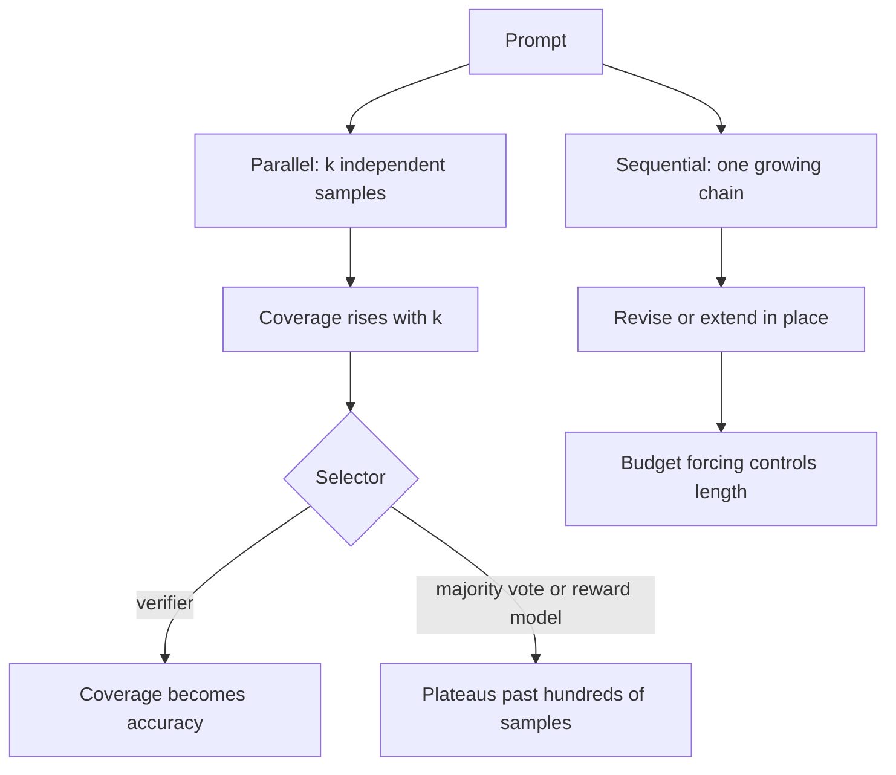

# The Inference-Time Scaling Paradigm {#sec-inference-time-scaling}

Training in @sec-training-to-reason spends compute once to bake reasoning into
the weights. This chapter is about the other lever: spending more compute at
inference, after the weights are frozen, to make a fixed model answer harder
questions. By the end a reader can explain why repeated sampling buys coverage
but not an answer, why sequential revision and parallel search are different
shapes of test-time compute with different ideal regimes, how compute-optimal
allocation routes a budget by prompt difficulty, and why the whole curve bends
back down when the thing that picks the answer is imperfect.

## Problem

A trained model has one knob left at inference: how much compute to spend per
prompt. The cheapest answer is one greedy decode. The question this chapter
answers is what you get for spending more, a thousand samples instead of one,
or a long deliberate chain instead of a short one, and whether that spend is
ever a better deal than training a larger model in the first place.

The reason the question is live is that the two spends are fungible. A larger
model costs more to train and more per token forever. Test-time compute costs
nothing at training and is paid only on the prompts that need it, which is most
of the value on a long tail of hard prompts and none of it on the easy
majority. If a small model plus extra inference can match a large model on the
hard prompts, the serving economics of @sec-serving-problem change, because you
move cost from a fixed asset you pay for on every request to a variable you
spend only when a prompt earns it.

## Design

Test-time compute comes in two shapes, and the distinction organizes the whole
chapter. Parallel scaling draws many independent samples and combines them.
Sequential scaling spends the compute in one growing chain, where each step
conditions on the last, revising or extending a single line of thought. Snell
et al. frame these as revising the proposal distribution sequentially versus
searching against a verifier in parallel, and the central empirical claim is
that neither dominates: the better shape depends on the prompt.

The parallel story starts with the simplest possible method. Draw $k$ samples
and ask what fraction of problems are solved by at least one of them. Brown et
al. call this coverage, and it is the ceiling on what any selection rule could
extract from the samples. Coverage rises smoothly with $k$ across four orders
of magnitude, well modeled as an exponentiated power law, which is the
inference-time analogue of the training scaling laws in @sec-scaling-laws. The
key word is coverage, not accuracy. A correct sample exists in the set; that is
not the same as knowing which one it is.

That gap is the design problem of parallel scaling. To turn coverage into an
answer you need a selector, and the selector is where the difficulty lives.
When the task has an automatic verifier, the unit tests and answer checkers and
proof checkers of @sec-training-to-reason, selection is free: run the verifier
on each sample and keep one that passes. Coverage converts directly into
accuracy, which is why repeated sampling pays most in code and formal math. When
there is no automatic verifier, you fall back to a heuristic selector, majority
vote over the answers or a learned reward model scoring each sample. These work
to a point and then plateau: Brown et al. report that majority vote and reward
models stop scaling past a few hundred samples even as coverage keeps climbing,
because the selector cannot tell the rare right answer from the many confident
wrong ones.



Sequential scaling spends the budget differently. Instead of $k$ independent
shots, the model keeps thinking in one trajectory, and the compute buys length
and revision rather than breadth. The reasoning models of
@sec-training-to-reason already do this natively: a long chain of thought is
sequential test-time compute that the RL of that chapter taught the model to
produce. s1 shows the lever in its barest form with budget forcing, a
decoding-time intervention that controls how long the model thinks by
suppressing the end-of-thinking token and appending the word "Wait" to push the
model to continue, or by forcing termination to cap the spend. Lengthening the
chain this way lets the model catch and fix its own errors, and accuracy rises
with the forced budget. Sequential and parallel are composable: you can draw
several long chains and select among them, and Snell et al. study exactly this
two-dimensional budget.

## Evolution

The methods are older than the paradigm. Self-consistency, sampling several
chains and taking a majority vote over final answers, is parallel scaling with
a majority selector and predates the reasoning-model era. Best-of-$n$ against a
reward model is parallel scaling with a learned selector. Process reward models,
trained in "Let's Verify Step by Step" and used as the dense verifier in
@sec-training-to-reason, are what makes verifier-guided search over partial
chains work, scoring steps rather than only final answers so a search can prune
early. What changed in 2024 was the framing: these stopped being tricks and
became a compute axis with its own scaling laws.

Brown et al. established the parallel law: coverage as a smooth, predictable
function of sample count, and the sharp dependence of its payoff on whether a
verifier exists. Snell et al. asked the allocation question. Given a fixed
test-time budget, how should you split it, more parallel samples, more
sequential revision, a deeper verifier search, and they showed the answer
depends on prompt difficulty. Easy prompts benefit from sequential refinement
of an already-good first guess; hard prompts benefit from broader parallel
search. Routing the budget by difficulty, their compute-optimal strategy, beat a
best-of-$n$ baseline by more than four times in efficiency, and on prompts where
a small model already had a foothold, a FLOPs-matched small model with extra
test-time compute outperformed a model roughly fourteen times larger. That is
the constraint arrow of the chapter made quantitative: inference compute
substituting for parameters.

The s1 and LIMO results sharpened a different edge. s1 reached strong
competition-math performance by supervised fine-tuning on only about a thousand
carefully chosen reasoning traces and then scaling at test time with budget
forcing. LIMO made the less-is-more claim explicit with a few hundred examples,
arguing that when a base model already encodes the knowledge from pre-training,
a small set of high-quality demonstrations is enough to elicit the reasoning,
and the heavy lifting moves to inference. Both point the same way: the capacity
may already be latent in the weights, and test-time compute is how you call it
out. This connects to the contested question in @sec-training-to-reason about
whether RL teaches new reasoning or elicits what is already there, seen now from
the inference side.

::: {.callout-important}
## What's contested
How far test-time compute keeps paying off is bounded by the quality of the
thing that selects or guides, and that bound is not a footnote. With a perfect
verifier, more samples never hurt: coverage rises monotonically and selection is
free, so the curve only bends toward the ceiling. With an imperfect verifier or
a heuristic selector, the curve can stop improving or turn down. More samples
give the selector more confident-but-wrong candidates to be fooled by, and an
optimization-against-the-selector effect appears that is the inference-time twin
of the reward hacking in @sec-rlhf: best-of-$n$ against a flawed reward model
can select the sample that games the model rather than solves the problem, and
past some $n$ the expected quality falls. Brown et al. see majority vote and
reward-model selection plateau past hundreds of samples while coverage keeps
climbing, which is the same gap from the other side: the answer is in the set
and the selector cannot find it. So the honest claim is conditional. Test-time
compute scales cleanly where verification is cheap and sound, and the cleaner
the verifier, the longer the curve pays. Where it is not, the scaling is bounded
by selector quality, and more compute is not free improvement.
:::

## Trade-offs

The paradigm is a set of balances, each with a knee.

- **Parallel versus sequential.** Parallel sampling is embarrassingly
  concurrent and latency-friendly, you can decode $k$ samples at once, but it
  needs a selector and wastes compute on redundant near-duplicates. Sequential
  revision uses compute more efficiently on prompts where a first guess is close,
  but it is inherently serial and pays full latency. Snell et al. show the right
  mix is difficulty-dependent, not a constant.
- **Coverage versus selection.** More samples always raise coverage, but the
  realized accuracy is capped by the selector. With a verifier the cap is the
  coverage ceiling; without one the cap is wherever majority vote or the reward
  model plateaus. Spending past that point buys nothing.
- **Test-time compute versus model size.** Extra inference can substitute for
  parameters on the hard tail, shifting cost from a fixed training-and-serving
  asset to a per-prompt variable. But the substitution has a regime: it works
  when the small model already has nonzero coverage, and it fails on prompts the
  small model never solves no matter how many tries, where only a stronger model
  or better training helps.
- **Data efficiency versus compute.** s1 and LIMO trade training data for
  test-time compute, eliciting latent capability with a tiny SFT set plus
  inference scaling. The bet holds only when the base model already encodes the
  domain; on genuinely new capability there is nothing latent to elicit.
- **Latency and cost versus accuracy.** Every method here multiplies the
  per-prompt compute and, for sequential methods, the latency. The product
  decision is which prompts deserve the spend, which is exactly what
  compute-optimal allocation formalizes.

::: {.callout-tip}
## Constraint arrow
This chapter reaches down to @sec-serving-problem and back up to
@sec-scaling-laws. Test-time scaling only makes sense if the serving layer can
deliver many samples or long chains cheaply, so the batching, key-value cache,
and decoding speed of @sec-memory-scheduling and @sec-faster-decoding set the
real price of a sample, and that price decides where compute-optimal allocation
stops. And it closes the loop opened in @sec-scaling-laws: the over-training
argument there said training compute substitutes for serving cost, while this
chapter says inference compute substitutes for parameters. Together they say the
model size is jointly set by training budget, serving cost, and how much
reasoning you intend to buy at inference, not by any one of them alone.
:::

## Implementation

The operational core is small. A parallel scaler is a sampling loop plus a
selector: draw $k$ completions at a temperature high enough for diversity, then
either run the verifier and keep a passing one, or take a majority vote, or
score with a reward model and take the best. The verifier path is the one that
scales, so the engineering effort goes where @sec-training-to-reason put it,
into making the checker sound and broad. A sequential scaler is a controlled
decode: detect when the model tries to stop and decide whether to let it, the
budget-forcing intervention, suppressing the stop token and injecting a
continuation cue to extend, or forcing a final answer to cap.

```python
# Parallel scaling: coverage is free, selection is the hard part.
def best_of_k(prompt, k, select):
    samples = [model.sample(prompt, temperature=0.8) for _ in range(k)]
    return select(samples)  # verifier > reward model > majority vote
```

The failure modes follow from the design. Selecting with an imperfect verifier
is the central one: more samples feed a flawed selector more chances to pick a
confident wrong answer, the inference-time reward hacking named in the contested
box, so the curve flattens or dips and more compute is wasted compute. Coverage
without a selector is the related trap: the right answer is provably in the set
and the system still returns a wrong one, which looks like a model failure but
is a selection failure. Sequential over-thinking is the third: budget forcing
past the useful point can make a model second-guess a correct answer into a
wrong one, so the forced budget itself has a knee. And the substitution fails
silently on prompts of zero coverage, where no amount of test-time compute helps
because no sample is ever correct, and the only fix is upstream in the model.

The capability, efficiency, and trust lens closes the chapter. Test-time scaling
is a capability lever that turns a frozen model into a stronger one on the hard
tail without retraining. It is an efficiency lever that moves cost off the fixed
asset onto the prompts that earn it, governed by the serving prices above. And
it is a trust hazard, because its entire payoff rides on the selector, and a
selector you do not trust converts more compute into more confidently wrong
answers. The verifier quality that bounded the training loop in
@sec-training-to-reason bounds the inference loop here too: the same ground
truth that makes RL safe is what makes test-time scaling pay.

## Further reading

- Brown et al., "Large Language Monkeys: Scaling Inference Compute with Repeated Sampling," 2024. [arXiv:2407.21787](https://arxiv.org/abs/2407.21787)
- Snell et al., "Scaling LLM Test-Time Compute Optimally can be More Effective than Scaling Model Parameters," 2024. [arXiv:2408.03314](https://arxiv.org/abs/2408.03314)
- Muennighoff et al., "s1: Simple test-time scaling," 2025. [arXiv:2501.19393](https://arxiv.org/abs/2501.19393)
- Ye et al., "LIMO: Less is More for Reasoning," 2025. [arXiv:2502.03387](https://arxiv.org/abs/2502.03387)
- Wang et al., "Self-Consistency Improves Chain of Thought Reasoning in Language Models," 2022. [arXiv:2203.11171](https://arxiv.org/abs/2203.11171)
- Lightman et al., "Let's Verify Step by Step" (process reward models for verifier-guided search), 2023. [arXiv:2305.20050](https://arxiv.org/abs/2305.20050)
