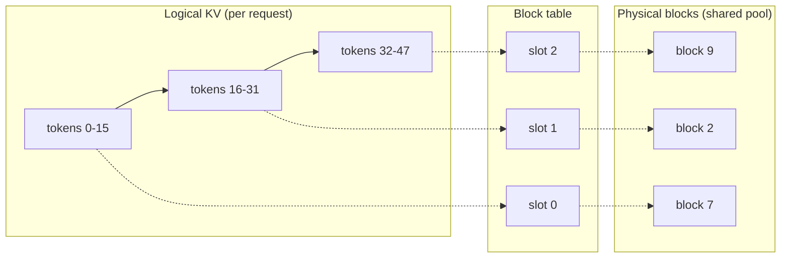

# Memory and Scheduling {#sec-memory-scheduling}

A serving engine spends most of its accelerator memory on one growing object, the key-value cache, and most of its scheduling effort deciding which requests share a forward pass. By the end of this chapter a reader can explain why a modern engine batches at the granularity of a single decode step, why it manages the key-value cache in fixed pages like an operating system, why it keeps a tree of shared prefixes, and why the newest systems split prefill and decode onto separate machines.

## Problem

@sec-serving-problem named the two phases of generation and their opposite shapes. Prefill reads the whole prompt in one compute-bound pass and produces the first token. Decode then emits one token per forward pass, each step reading the entire key-value cache for one new query, so decode is memory-bandwidth-bound and runs at batch size one per request unless the engine batches across requests. This chapter owns the consequences of those two facts for memory and for scheduling.

The memory fact is that the key-value cache is large, per-request, and grows by one slot per layer per generated token. For a request of length $L$, the cache holds $2 \cdot L \cdot n_{\text{layers}} \cdot n_{\text{kv}} \cdot d_{\text{head}}$ values, the factor of two for keys and values. On a model with billions of parameters the weights are fixed, but the cache for a few dozen concurrent long-context requests can exceed the weights, and it appears and disappears as requests arrive and finish. A naive engine reserves the maximum possible length for every request up front, which wastes most of the reservation for requests that finish early and caps the batch size far below what the hardware could hold.

The scheduling fact is that requests do not share a length. In a batch of generations, one request may stop at twenty tokens and another run to two thousand. If the engine schedules a batch and waits for every member to finish before admitting the next, the short requests sit idle inside a padded batch while the longest one decodes, and newly arrived requests wait behind the whole batch. Throughput collapses to the pace of the slowest member, and latency for a new arrival is the tail of the batch in front of it.

So the problem has two halves that this chapter treats together: pack the key-value cache so memory is not wasted, and schedule the forward passes so no request waits on another's length.

## Design

The first design idea is to schedule at the granularity of an iteration rather than a request. An iteration is one forward pass that advances every active request by a single token. After each iteration the scheduler is free to remove requests that just emitted their stop token and admit waiting requests into the next iteration's batch. This is **continuous batching**, also called iteration-level scheduling, introduced by Orca (Yu et al., OSDI 2022). The batch is no longer a fixed cohort that lives and dies together; it is a sliding window over the active set, refilled every step. A request that finishes at token twenty leaves immediately and its slot is reused, instead of padding out the batch until the longest member finishes.

Continuous batching exposes a memory problem. If admission happens every iteration, the engine must allocate and free key-value cache space every iteration, for requests whose final length it does not know. Reserving a contiguous maximum-length buffer per request, the obvious scheme, fragments memory: a finished request leaves a hole too small for the next, and reserved-but-unused tail space is dead weight. Measurements in the vLLM paper put the waste from this fragmentation and over-reservation at the majority of cache memory in prior systems.

The second design idea removes that waste by borrowing virtual memory from operating systems. **PagedAttention** (Kwon et al., SOSP 2023) stores the key-value cache in fixed-size blocks, each holding the keys and values for a fixed number of tokens, and lets a request's logical sequence of blocks map to physically non-contiguous blocks through a block table. The attention kernel is rewritten to gather keys and values through that table instead of assuming contiguity. Now allocation is per block, not per request: a request grows by appending a block when its current block fills, memory is shared at block granularity across all requests, and the only internal waste is the partial final block. The analogy is exact. The block is a page, the block table is a page table, and the engine is a memory manager that hands out and reclaims pages as sequences grow and finish. vLLM is the serving system built on this idea, and it reported two to four times the throughput of the prior generation at the same latency by lifting the achievable batch size.

Paging also makes sharing cheap, which is the third design idea. Two requests that begin with the same prompt, a shared system prompt or a few-shot preamble, compute identical keys and values for that prefix. Under paging, they can point their block tables at the same physical blocks for the shared prefix and diverge only where their tokens diverge, with copy-on-write when one writes into a shared block. **RadixAttention** (Zheng et al., NeurIPS 2024, the SGLang runtime) makes this systematic by storing all cached prefixes in a radix tree keyed by token sequence, with least-recently-used eviction. A new request walks the tree to find the longest cached prefix of its prompt, reuses those blocks, and computes only the uncached suffix. Prefix caching turns the repeated structure of real workloads, shared system prompts, multi-turn chat history, branching agent calls, into reused computation rather than recomputed computation.

The fourth design idea separates the two phases onto different hardware. Prefill is compute-bound and bursty; decode is memory-bandwidth-bound and steady. Running them in the same batch on the same device means a long prefill stalls the decodes waiting behind it, and the two phases want different parallelism and different batch shapes. **Prefill/decode disaggregation** (DistServe, Zhong et al., OSDI 2024; Mooncake, Qin et al., 2024) runs prefill on one pool of machines and decode on another, transferring the key-value cache between them over the network. Each pool is provisioned and parallelized for its own phase, and neither interferes with the other's latency. DistServe optimizes the placement for goodput, the rate of requests that meet both a time-to-first-token target for prefill and a time-per-output-token target for decode. Mooncake centers the whole architecture on the key-value cache, pooling CPU DRAM and SSD across the cluster into a disaggregated cache that prefill writes and decode reads.

## Evolution

The lineage is a steady migration of ideas from operating systems into the serving engine. Before Orca, serving systems batched at request granularity: form a batch, run it to completion, return the results. This is request-level scheduling, and it inherits the static-batch pathology of any padded-cohort design. Orca's contribution was to schedule at iteration granularity and to make the batch a living set, refilled every step, which is the single change that lets a serving engine keep accelerators busy under heterogeneous request lengths. Orca also introduced selective batching, batching the parts of the computation that can be batched across requests of different lengths while running attention per request.

vLLM took the continuous-batching idea as given and attacked the memory waste it exposed. Its insight was that the key-value cache is exactly the kind of object virtual memory was invented for: a per-process allocation that grows unpredictably and must share a fixed physical pool without fragmentation. PagedAttention is the application of paging to that object, and the rest of vLLM, the block manager, the swapping of blocks to host memory under pressure, the copy-on-write sharing, follows from treating the cache as paged virtual memory. The result reset the throughput baseline for open serving.

SGLang pushed on sharing. Once the cache is paged and blocks can be shared, the question is how to find shareable prefixes automatically across a stream of requests with arbitrary overlap. The radix tree is the data structure that answers it: it indexes every cached prefix by its token sequence, supports longest-prefix match for a new request, and supports eviction by least-recently-used so the cache stays within budget. RadixAttention turns prefix reuse from a special case, handled by hand for a known shared prompt, into a default the runtime applies to all traffic.

Disaggregation is the most recent move and it inverts an assumption. Continuous batching and paging both assume prefill and decode share a device and a batch; the engineering then fights the interference between them, which Sarathi-Serve (Agrawal et al., OSDI 2024) addresses within a single device by splitting prefill into chunks and coalescing each chunk with ongoing decodes, so a long prefill never stalls decode. DistServe and Mooncake take the opposite route: stop sharing the device at all, put each phase on hardware sized for it, and pay a network transfer of the key-value cache between them. Both lines are live. The within-device line keeps one resource pool and schedules carefully; the disaggregated line accepts a transfer cost to remove interference entirely.

::: {.callout-important}
## What's contested
Whether to disaggregate prefill and decode, or to keep them on the same device and schedule around the interference, is unsettled. Disaggregation removes phase interference and lets each pool scale and parallelize independently, and at large scale with long prompts the reported goodput gains are substantial. But it pays a network transfer of the key-value cache on every request, needs enough cross-machine bandwidth to hide that transfer, and complicates routing and fault handling. The colocated camp, exemplified by chunked-prefill scheduling, argues that careful within-device scheduling captures most of the benefit at a fraction of the operational cost and with no transfer. The right answer depends on prompt length, the time-to-first-token and time-per-output-token targets, and the interconnect: there is no setting where one approach dominates across all workloads.
:::

::: {.callout-tip}
## Constraint arrow
The attention design upstream sets how hard this chapter's job is. The size of the key-value cache, the term that paging exists to manage, is fixed by the number of key-value heads chosen in @sec-transformer-architecture. Multi-query and grouped-query attention shrink that term by sharing key-value heads across query heads, and the latent attention of @sec-moe-ssm-hybrids compresses it further. A smaller per-token cache means more sequences fit in the same memory, which raises the achievable batch size, which is the lever continuous batching pulls for throughput. An attention variant chosen for cache size is, in effect, a scheduling decision made one layer down.
:::

## Trade-offs

Each design idea buys a benefit at a named cost.

- **Block size in paging.** A small block wastes little in the partial final block and shares at fine granularity, but multiplies block-table entries and per-kernel gather overhead. A large block cuts that overhead but wastes more tail memory and shares more coarsely. The block size is a tuning knob, not a constant, and the right value depends on typical sequence length and how much prefix sharing the workload has.
- **Prefix-cache retention versus memory.** Keeping more prefixes in the radix tree raises the hit rate for workloads with shared structure, but the cache competes with live requests for the same physical blocks. Under memory pressure the engine must evict cached prefixes to admit new work, so the prefix cache is a bet that reuse will pay before the blocks are reclaimed. Workloads with little overlap pay the bookkeeping and get little back.
- **Disaggregation versus colocation.** Disaggregation removes interference and lets each phase scale alone, at the cost of a key-value cache transfer per request and the bandwidth to hide it. Colocation with chunked prefill keeps one pool and one transfer-free path, at the cost of scheduling complexity and some residual interference. The crossover is set by prompt length and latency targets.
- **Throughput versus latency in batching.** A larger continuous batch raises throughput but lengthens each iteration, which raises time-per-output-token for every request in it. Admission is therefore a latency knob: the engine can cap batch size or reserve headroom to protect tail latency, trading some throughput for it.

## Implementation

The engine is a loop and a memory manager. The loop is iteration-level: each step, the scheduler picks the set of requests to run, the model runs one forward pass over them, the sampler produces one token each, finished requests are retired, and waiting requests are admitted into the next step. In vLLM this is the engine step (`vllm.LLMEngine.step`, `vllm/engine/llm_engine.py`), which calls the scheduler to form the batch and the model runner to execute it. The scheduler tracks queues for running, waiting, and swapped requests, and moves requests between them as cache blocks are allocated and reclaimed.

The memory manager owns the block pool. It maintains a free list of physical blocks and a per-request block table mapping logical positions to physical blocks. Allocation appends a block when the current one fills; freeing returns a request's blocks to the pool on completion. Under pressure the manager can preempt a request, either recomputing its cache later or swapping its blocks to host memory and back, which is the serving analogue of paging to disk. The attention kernel reads through the block table, so the physical layout stays invisible to the rest of the model. For prefix sharing, the block table of a new request is initialized to point at the cached blocks of its longest matching prefix, with a reference count so a shared block is freed only when its last user finishes, and copied on first write past the shared point.

Two operational realities are worth naming. First, the partial final block is the only internal fragmentation paging leaves, so average waste falls as sequences lengthen relative to block size, which is why long-context workloads benefit most from paging. Second, prefix-cache hit rate is workload-shaped: a chat service with a fixed system prompt or an agent loop that re-sends a long tool preamble can see most of its prefill served from cache, while a stream of unrelated single-turn prompts sees almost none. Instrumenting the hit rate, the achievable batch size, and the preemption rate is how an operator reads whether the memory manager is winning.

## Further reading

- Yu et al., "Orca: A Distributed Serving System for Transformer-Based Generative Models," OSDI 2022. [usenix.org/conference/osdi22/presentation/yu](https://www.usenix.org/conference/osdi22/presentation/yu)
- Kwon et al., "Efficient Memory Management for Large Language Model Serving with PagedAttention" (vLLM), SOSP 2023. [arXiv:2309.06180](https://arxiv.org/abs/2309.06180)
- Zheng et al., "SGLang: Efficient Execution of Structured Language Model Programs" (RadixAttention), NeurIPS 2024. [arXiv:2312.07104](https://arxiv.org/abs/2312.07104)
- Zhong et al., "DistServe: Disaggregating Prefill and Decoding for Goodput-optimized Large Language Model Serving," OSDI 2024. [arXiv:2401.09670](https://arxiv.org/abs/2401.09670)
- Qin et al., "Mooncake: A KVCache-centric Disaggregated Architecture for LLM Serving," 2024. [arXiv:2407.00079](https://arxiv.org/abs/2407.00079)
- Agrawal et al., "Taming Throughput-Latency Tradeoff in LLM Inference with Sarathi-Serve" (chunked prefill), OSDI 2024. [arXiv:2403.02310](https://arxiv.org/abs/2403.02310)
