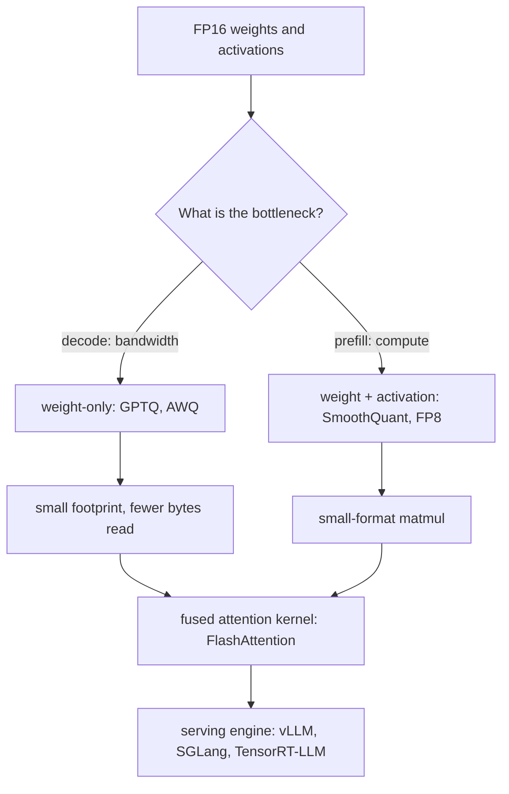

# Quantization and Kernels {#sec-quantization-kernels}

Decoding is bound by memory: by how many bytes of weights and cache must
cross the bus per token, and by how many bytes of attention intermediates
must be written and read back. This chapter is about two levers that attack
that bound, shrinking the numbers with quantization and refusing to move the
intermediates with fused kernels. By the end a reader can explain why GPTQ,
AWQ, and SmoothQuant make different bets, why a model can run in INT4 or FP8
without falling over, why FlashAttention never materializes the score matrix,
and why the choice among vLLM, SGLang, and TensorRT-LLM is a choice about
which of these wins the engine has already made.

## Problem

A weight in FP16 costs two bytes. A seventy-billion-parameter model is
therefore one hundred and forty gigabytes before a single token is served,
which already exceeds one accelerator. The serving problem of
@sec-serving-problem and the scheduling of @sec-memory-scheduling both begin
from this fact: capacity is spent on a static weight footprint and a growing
key-value cache, and what is left bounds the batch.

The deeper trouble is bandwidth, not just capacity. Decoding emits one token
at a time, so each step reads the whole weight set to produce a single
column of activations. The arithmetic intensity is low, the accelerator's
compute units idle, and wall-clock is set by how fast bytes move from
high-bandwidth memory, not by how fast they multiply. @sec-faster-decoding
attacks this from the algorithm side by doing more useful work per pass. This
chapter attacks it from below, by making each byte carry less and by moving
fewer of them.

Attention has its own version of the same disease. The naive computation
forms the full $n \times n$ score matrix, writes it to memory, reads it back
to apply softmax, writes again, and reads once more to weight the values.
For a long sequence that matrix dwarfs the inputs, and the kernel spends its
time on memory traffic rather than on the matmuls that matter. The
architecture of @sec-transformer-architecture makes attention central, and
@sec-structured-long-context pushes the sequence length up, so the cost of
moving these intermediates grows faster than the cost of the model itself.

## Design

Two ideas answer the problem. Quantization shrinks each number. Fused
kernels stop writing intermediates that will only be read back.

**Quantization** maps a high-precision tensor onto a small set of levels and
stores the levels plus a scale. For integer quantization the rule is a scale
and a round,

$$
\hat{w} = s \cdot \mathrm{round}\!\left(\frac{w}{s}\right), \qquad
s = \frac{\max |w|}{2^{b-1} - 1},
$$

so a block of weights becomes $b$-bit integers and one floating-point scale.
The granularity of $s$ is the first design axis: one scale per tensor is
cheapest to store and worst at handling spread, one scale per output channel
or per small group of weights costs a little metadata and recovers most of
the accuracy. Floating-point quantization keeps a sign, exponent, and
mantissa in the small budget instead of a uniform grid, which trades some
precision near zero for dynamic range, and the hardware can multiply the
small format natively.

The reason quantization is not trivial is the outlier. Weights have a
well-behaved distribution and quantize cleanly. Activations in a trained
transformer do not: a few channels carry values orders of magnitude larger
than the rest, and a single per-tensor scale chosen to cover them throws
away all precision on the rest. Every serious method is a different answer to
the outlier.

- **GPTQ** quantizes weights only, one layer at a time, and treats it as a
  reconstruction problem. It uses approximate second-order information, the
  Hessian of the layer's output error, to quantize weights column by column
  while updating the remaining full-precision weights to absorb the error
  just introduced. This pushes the bitwidth to three or four bits per weight
  with little quality loss, and it touches activations not at all.
- **AWQ** also quantizes weights only, but starts from the observation that
  not all weights matter equally. Protecting roughly the top one percent of
  salient weight channels, identified by watching the activation magnitudes
  rather than the weights, removes most of the error. AWQ folds that
  protection into a per-channel scaling found by search, with no
  backpropagation and no reconstruction, so it does not overfit the small
  calibration set.
- **SmoothQuant** targets the harder regime where activations are quantized
  too. It applies a mathematically equivalent transformation that divides the
  activations by a per-channel factor and multiplies the weights by the same
  factor, migrating the difficulty out of the spiky activations and into the
  smooth weights. After this smoothing, both can be taken to INT8, which
  unlocks integer matmuls for the whole layer, not just integer storage.

That last distinction is the second design axis: **weight-only versus
weight-and-activation**. Weight-only quantization (GPTQ, AWQ) shrinks the
footprint and the bytes that decode must read, which is exactly the
bandwidth-bound decode regime. It does not by itself speed the
compute-bound matmuls of a large-batch prefill, because the activations are
still high precision and the weights are dequantized before the multiply.
Weight-and-activation quantization (SmoothQuant, FP8) lets the matmul itself
run in the small format, which is what helps when compute, not bandwidth, is
the bottleneck.

The **formats** are the alphabet these methods write in. INT8 and INT4 are
uniform integer grids with a scale, cheap and well supported. FP8 comes in
two NVIDIA-specified encodings, E4M3 with more mantissa for precision and
E5M2 with more exponent for range, and is native on recent hardware so it
accelerates the multiply itself. GGUF is not a number format but a container:
the file standard of the llama.cpp ecosystem, packing weights in block-wise
"k-quant" schemes together with all metadata, so a quantized model is one
portable file that runs on CPU and Apple silicon as readily as on a GPU.

**Fused kernels** answer the memory-traffic half. FlashAttention computes
exact attention without ever materializing the score matrix. It tiles the
query, key, and value matrices into blocks that fit in fast on-chip SRAM,
and it computes the softmax online: as each key block arrives it keeps a
running maximum and a running normalizer, rescaling the partial output so
the final result equals the full softmax without the full matrix ever
existing.

$$
m_i = \max(m_{i-1}, \tilde{m}_i), \qquad
\ell_i = e^{m_{i-1}-m_i}\,\ell_{i-1} + e^{\tilde{m}_i - m_i}\,\tilde{\ell}_i
$$

The output never leaves SRAM until it is final, the $n \times n$ matrix
never touches high-bandwidth memory, and the backward pass recomputes blocks
on the fly rather than storing them. This is the core trade the kernel makes:
spend extra arithmetic to avoid memory traffic, which is the right trade
precisely because attention was memory-bound.

## Evolution

Quantization for language models has a short, sharp history driven by the
outlier. Naive per-tensor INT8, carried over from vision models, collapsed on
large transformers once the emergent activation outliers appeared past a
certain scale. The first wave of fixes isolated the outliers in higher
precision while quantizing the rest. GPTQ (2022) then showed that careful
second-order weight reconstruction reaches three to four bits with negligible
loss, making weight-only low-bit serving practical. SmoothQuant (2022)
attacked the activation side by moving the difficulty into the weights,
enabling full INT8 with reported speedups around one and a half times and
memory roughly halved. AWQ (2023) reframed weight-only quantization around
salience and per-channel scaling, reporting more than threefold speedups over
the FP16 baseline while avoiding the overfitting risk of reconstruction. The
format frontier moved in parallel, from FP16 to INT8 to INT4 on the weight
side, and to FP8 once hardware made the small float native.

Kernels evolved on a separate track aimed at the same bound. FlashAttention
(Dao et al., 2022) established the IO-aware, never-materialize design.
FlashAttention-2 (Dao, 2023) rebalanced the work, parallelizing across the
sequence dimension and reducing non-matmul operations to push utilization
higher. FlashAttention-3 (Shah et al., 2024) targeted the Hopper generation
specifically, overlapping the asynchronous tensor-core and memory engines and
adding low-precision FP8 paths, so the kernel and the quantization story
converged on the same hardware.

The engines packaged these advances into systems. FasterTransformer was the
early hand-optimized baseline. vLLM (Kwon et al., 2023) made paged KV-cache
management the centerpiece, treating cache memory like operating-system
virtual memory to cut fragmentation, and it pairs that with quantized weights
and FlashAttention-style kernels. SGLang (Zheng et al., 2023) added
RadixAttention to reuse shared prefixes across requests, which matters for
the structured and agentic workloads of later chapters. TensorRT-LLM is
NVIDIA's compiler-driven engine, fusing kernels and selecting low-precision
paths for its own hardware, distributed as an open repository rather than a
paper.

## Trade-offs

Every choice in this chapter spends one resource to buy another, and the
right point depends on the serving regime, not on a universal best.

- **Weight-only versus weight-and-activation.** Weight-only quantization is
  the right tool for bandwidth-bound decode: it shrinks the footprint and the
  bytes read per token, and the matmul still runs in higher precision after
  dequantization. It does little for a compute-bound prefill. Quantizing
  activations too, with SmoothQuant or FP8, runs the matmul in the small
  format and helps the compute-bound regime, at the cost of confronting the
  activation outliers head-on.
- **Granularity versus overhead.** Finer scales, per channel or per small
  group, recover accuracy that per-tensor scaling loses, but each block
  carries its own scale and each matmul pays a dequantization step. Coarser
  is faster and smaller; finer is more accurate. The knee depends on how
  spread the tensor's values are.
- **Precision versus capability.** Lower bitwidth always reduces footprint
  and usually raises throughput, but it perturbs the model's outputs. How
  much that perturbation costs depends on what you measure, which is the
  subject of the constraint arrow below.
- **Kernel arithmetic versus memory traffic.** FlashAttention recomputes in
  the backward pass and does extra rescaling rather than store the score
  matrix. This is a net win only because attention was memory-bound; the
  same recompute would be wasteful on a compute-bound kernel.

::: {.callout-important}
## What's contested
Whether low-bit quantization preserves capability uniformly is unsettled.
Aggregate metrics like perplexity often stay close to the full-precision
baseline at four bits, which is why four-bit weight-only serving is common.
But there is evidence that the damage is uneven: long-context recall,
multi-step reasoning, multilingual coverage, and rare factual knowledge can
degrade more than a perplexity number suggests, and the worst-hit cases may
be exactly the capabilities a deployment cares about. The live questions are
how far bitwidth can drop before specific capabilities break, whether
weight-only and weight-and-activation schemes degrade the same skills, and
whether the standard benchmarks even surface the loss. Treat "lossless at
four bits" as a claim about an average metric, not a guarantee about a task.
:::

::: {.callout-tip}
## Constraint arrow
Quantization trades numerical precision for footprint and speed, and the bill
for that trade is paid one layer up, at evaluation. A quantized model is a
different model: its logits are perturbed, and the only question that matters
is whether it still produces the outputs that @sec-benchmarks measures. The
footprint win is read off the weight file immediately; the capability cost is
invisible until the benchmark and judging harness of @sec-benchmarks and
@sec-judging-holistic re-run on the quantized weights. A serving decision that
looks like pure systems engineering is therefore gated by an evaluation that
sits above it, and shipping a quantized model without that re-run is shipping
an unmeasured model.
:::

## Implementation

In practice the chapter reduces to a routing decision and a small set of
levers. The regime picks the method: bandwidth-bound decode favors
weight-only GPTQ or AWQ; a compute-bound prefill or a throughput-first
deployment favors FP8 or SmoothQuant so the matmul runs small; CPU and Apple
silicon targets favor GGUF k-quants for portability; an NVIDIA production
stack reaches for TensorRT-LLM to fuse and compile down to the hardware.

The engines wire these together rather than reinventing them. vLLM exposes
quantization as a serving option over its paged cache (`LLM`,
`vllm/entrypoints/llm.py`) and dispatches attention to a FlashAttention
backend; SGLang layers prefix reuse on top
(`RadixCache`, `python/sglang/srt/mem_cache/radix_cache.py`); TensorRT-LLM
compiles a model definition into a fused, low-precision engine for a target
GPU (`github.com/NVIDIA/TensorRT-LLM`). The common pattern is the same:
calibrate or convert the weights once into a quantized artifact, load it into
an engine that already owns a fused attention kernel and a cache manager, and
serve.

The operational caution is the one the arrow names. A quantized artifact is
cheap to produce and easy to mistake for free. The footprint saving is real
and immediate; the capability question is not answered until the evaluation
of @sec-benchmarks re-runs on the quantized weights, not on the original.
The discipline that keeps this honest is to treat every quantization recipe
as a model change subject to the same measurement, and to record the format,
the bitwidth, and the granularity alongside the scores so the trade is
auditable.

## Further reading

- Frantar et al., "GPTQ: Accurate Post-Training Quantization for Generative Pre-trained Transformers," 2022. [arXiv:2210.17323](https://arxiv.org/abs/2210.17323)
- Lin et al., "AWQ: Activation-aware Weight Quantization for LLM Compression and Acceleration," 2023. [arXiv:2306.00978](https://arxiv.org/abs/2306.00978)
- Xiao et al., "SmoothQuant: Accurate and Efficient Post-Training Quantization for Large Language Models," 2022. [arXiv:2211.10438](https://arxiv.org/abs/2211.10438)
- Micikevicius et al., "FP8 Formats for Deep Learning," 2022. [arXiv:2209.05433](https://arxiv.org/abs/2209.05433)
- Dao et al., "FlashAttention: Fast and Memory-Efficient Exact Attention with IO-Awareness," 2022. [arXiv:2205.14135](https://arxiv.org/abs/2205.14135)
- Dao, "FlashAttention-2: Faster Attention with Better Parallelism and Work Partitioning," 2023. [arXiv:2307.08691](https://arxiv.org/abs/2307.08691)
- Shah et al., "FlashAttention-3: Fast and Accurate Attention with Asynchrony and Low-precision," 2024. [arXiv:2407.08608](https://arxiv.org/abs/2407.08608)
- Kwon et al., "Efficient Memory Management for Large Language Model Serving with PagedAttention" (vLLM), 2023. [arXiv:2309.06180](https://arxiv.org/abs/2309.06180)
- Zheng et al., "SGLang: Efficient Execution of Structured Language Model Programs," 2023. [arXiv:2312.07104](https://arxiv.org/abs/2312.07104)
- NVIDIA, "TensorRT-LLM," 2023. [github.com/NVIDIA/TensorRT-LLM](https://github.com/NVIDIA/TensorRT-LLM)
- llama.cpp project, "GGUF format," 2023. [github.com/ggml-org/llama.cpp](https://github.com/ggml-org/llama.cpp)
