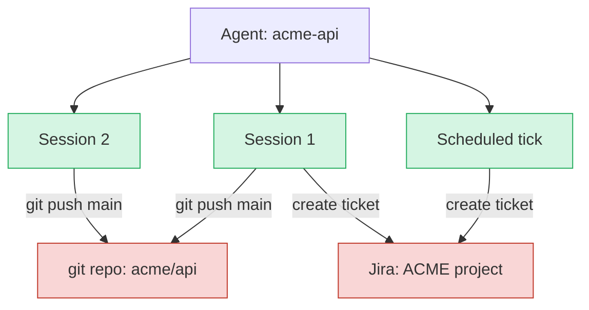

# The Harness {#sec-the-harness}

The harness is the scaffold around the model: the runtime that turns model
output into tool calls and tool results back into model input, manages the
context window, routes tools, sandboxes execution, and exposes the verbs that
let a person pause, redirect, fork, or kill a running loop. By the end of this
chapter a reader can explain why a loop that looks trivial as a flowchart needs
this much machinery, and why the shape of that machinery moves an evaluation
score as much as a model swap does.

## Problem

The contract is small. Create a session bound to an agent definition. Drive
its loop: send context to the model, dispatch the tool calls it returns, append
the results, repeat until done or interrupted. Resume after a crash or a wait.
Interrupt mid-flight. Fork at a checkpoint. Drawn as a flowchart the loop is a
box and an arrow back to itself.

It stops being trivial the moment it meets production. A tool holds a
connection across turns, so the loop is no longer stateless between steps. The
context window fills, so the loop has to decide what to forget. A user hits
cancel while a sandbox command is mid-execution, so the loop has to stop
something it does not directly control. Two replicas both think they own the
same scheduled tick, so the loop has to coordinate with a copy of itself it
cannot see. The harness is where these frictions are absorbed or leaked. It
owns mechanism, not policy: it does not decide who may call (identity,
@sec-security-authorization), where the model comes from (model access), or
which actions require a human (oversight, @sec-oversight-control). It decides
how those decisions are carried out, and the most consequential mechanism it
owns is the ability to stop the loop.

## Design

The core idea is that each verb in the contract is a separate mechanism with
its own failure surface, and the harness is the place where they are made to
survive contact with reality. Six mechanisms carry most of the design, and each
exists because a naive version leaks.

**Instance lifecycle decouples blast radius from deploy.** The first decision
is when an agent definition (a prompt, a tool set, a model binding) becomes a
live instance. The obvious starting point is a singleton: one runner shared
across every session, isolated only by a `session_id`, zero allocation per
request. The hidden cost is not performance, it is rollout granularity. With a
singleton, the prompt is a deploy-time constant, so a bad prompt regresses 100%
of sessions until rollback completes. OpenAI's GPT-4o sycophancy episode is the
shape of this: the update rolled out April 25, 2025, rollback began April 28,
and the full revert took roughly a day. A runtime registry resolves a prompt
version per request instead, which lets a regression touch a canary slice while
the stable version keeps serving everyone else. The blast radius now equals the
canary, not the fleet. The cost is a resolution hop, a cross-replica
consistency story, and a new variable in every incident.

**The cancellation-awareness cascade decides whether cancel is real.**
Cancellation is exactly as effective as its most-blind hop. The harness can see
an interrupt flag instantly, but the flag has to travel down every layer that
might be mid-execution: the model call has to honor its context deadline, the
tool dispatch layer has to propagate cancellation into the tool, the sandbox
command has to respect SIGTERM, and a stateful protocol call has to respect
RPC-level cancellation. A model call that ignores its deadline holds the session
for tens of seconds past cancel. A sandbox command that ignores SIGTERM holds
it for the full grace period. So "the runtime supports cancellation" is a claim
about every hop in the cascade, and a single uncooperative layer makes the
cancel cosmetic. This is why interruption is a primitive and not a feature: the
pause a human-in-the-loop approval depends on is threaded through every hop or
it is theater. The decision about what requires approval belongs to oversight;
the pause that lets the approval happen is the runtime's verb.

**A lock prevents overlap, not duplication.** When the loop runs on a schedule,
every replica runs its own scheduler, so without coordination every replica
fires every tick. The usual fix is an agent-level distributed lock acquired
before the run. It prevents two replicas from firing the same tick
concurrently. It does not make the tick's side effects exactly-once. If a tick
posts to Slack, opens a ticket, then crashes before recording "done," recovery
replays it and the Slack message posts twice. The lock coordinates who runs;
exactly-once requires coordinating what already happened to the outside world.
Idempotency keys at the side-effect call sites close that gap, and they are a
different guarantee that a scheduler with only a lock does not have.

**The session lock is the wrong altitude for a resource conflict.** A harness
almost always has session-level locking, which stops two `Run()` calls from
mutating one session at once. It says nothing about two different sessions of
the same agent touching the same external resource. Two coding sessions push
conflicting commits to one branch. A user session and a scheduled tick target
the same external state, neither aware of the other. The lock is in the
harness; the conflict is at the resource, and the harness lock does not reach
it.

Every session in green is individually locked; every shared resource in red is
unlocked. The fix lives at the resource: a worktree per session that moves the
conflict to a merge, or a resource-level lock keyed on the named resource, or
optimistic reconciliation on the external system. The right choice depends on
whether the downstream system already has its own concurrency control to lean
on. Git ref updates and database row locks are real coordination primitives;
where they exist the harness can defer to them.

**Compaction's loss is invisible to the agent.** A long-running loop hits the
context window, and the harness has to answer two questions that do not answer
themselves: what gets preserved, and who decides. Automatic compaction
summarizes older turns so the session runs past the hard limit, and its failure
mode is structural: summarization discards detail and the agent has no signal
about what it lost. Anthropic's cookbook measured compaction preserving three
of three high-level facts and zero of three obscure specifics. The alternative
is externalization, where the agent writes what it wants to keep to a file
(`progress.md`, `plan.md`) and reloads after compaction. That trades the
summary's blindness for the agent's blindness about its own future needs.
Neither is mechanical, which is the subject of the contested box below.

**What the registry admits to the catalog, it admits to the model's
instructions.** Dispatch is how a tool runs; the registry is how the model
learns the tool exists. A static flat list sends every tool in every system
prompt and runs out at roughly 30 to 50 tools, because function-calling
accuracy falls as the catalog grows and robustness suffers specifically when
irrelevant tools are present. Beyond that the runtime needs per-turn selection.
The security-flavored failure is the sharpest: a malicious tool description at
the catalog layer can inject instructions into the model through the system
prompt, bypassing the user prompt entirely (Invariant Labs'
mcp-injection-experiments). The registry is not a neutral lookup table, which
is why catalog admission is a trust decision handed to
@sec-security-authorization.

Tools fold into this design along a statefulness axis. Stateless tools (a web
fetch, a sandbox exec given a sandbox ID) hold no harness-side state and scale
trivially. Stateful-connection tools (MCP, gRPC streams) carry negotiated
capabilities and cursors in a connection the harness holds for the session, and
dispatching them through one mechanism shared with stateless calls mishandles
one class or the other. The hardest variant is a single logical operation that
mixes both, because its partial-failure space is the product of the two.

## Evolution

Each mechanism arrived because an earlier, simpler version broke at scale.

Stateful tool transport is the clearest lineage. The simplest design holds
connections in memory per replica, keyed by `(session_id, server_url)`, opened
lazily. It works until the platform scales horizontally, and then statefulness
fights the load balancer: the MCP 2026 roadmap names stateful sessions as the
primary scaling bottleneck. The concrete failure is the reconnect storm. When a
replica holding N sessions, each connected to M servers, dies, recovery is N
times M simultaneous reconnections against the surviving infrastructure, each
renegotiating capabilities and losing cursor state. The mechanism dictated the
mitigation: session affinity to keep a connection on one replica, reconnect
backoff with jitter to desynchronize the herd, and resumable streams to make
reconnection cheap. The MCP spec followed this curve directly, deprecating
HTTP+SSE in favor of Streamable HTTP, where a reconnect replays from a cursor
using `Mcp-Session-Id` plus `Last-Event-ID` instead of restarting. The same
spec hardened a related hazard pooling alone does not touch: when several
concurrent sessions for one user race to refresh a single-use OAuth token, the
losers present an already-consumed token and fail, so the 2026 spec mandates
RFC 8707 resource indicators to keep a token from being redeemed against the
wrong server.

Tool selection evolved as a ladder. The static flat list gave way to dynamic
tool-RAG, which embeds the schemas and retrieves the top-k relevant per turn,
scaling to thousands of tools at the cost of a retrieval layer with its own
error modes. Hierarchical namespacing with mount and unmount shows a pruned
subset per phase, read-only tools while understanding a problem and write tools
while fixing it, which requires the runtime to track phase. Model-driven
discovery gives the model a `list_available_tools` tool and lets it ask, which
raises the ceiling but makes discovery quality a function of model capability
the runtime does not own.

The scheduler followed the same pressure. In-process and external-cron
schedulers give way to durable execution frameworks (Temporal, Inngest,
Restate) once a tick needs multi-step choreography with external side effects,
because probabilistic model behavior makes naive retry insufficient, which is
exactly the case durable journaling is built for. Multi-agent composition has a
parallel arc, with OpenAI's experimental Swarm superseded by the Agents SDK,
but composition itself belongs to @sec-multi-agent-systems and the harness only
owns whether the composed agents share or isolate session and sandbox state.

## Trade-offs

Every mechanism in the design is a balance with a knee.

- **Singleton versus registry.** A singleton is fine at one or two agent types
  and starts hurting past three or four, when a prompt regression in one agent
  forces a rollback that reverts an unrelated fix in another because they
  shared a deploy. That incident is when versioning stops being optional.
- **Persistent versus ephemeral sessions.** A persistent session accumulates
  context, so a monitoring agent remembers last week's baseline, but events
  grow without bound, which makes context management mandatory. An ephemeral
  session is fresh per tick and correct when each tick is independent.
  Persistent for a stateless job buys unbounded storage for nothing; ephemeral
  for a job that needs memory throws the memory away every tick.
- **Shared versus isolated state.** Shared session and sandbox is cheapest and
  pays with races and prompt contamination. Full sandbox isolation is the most
  plumbing and the strongest containment: Geng and Neubig measured worktree
  isolation at 59.1% against soft instruction-level isolation at 56.1% on
  Commit0-Lite, and showed soft isolation falling below a single-agent baseline
  on PaperBench. Instruction-level constraints are advisory; real isolation
  does not depend on the model's compliance.
- **Compaction versus externalization versus a bigger window.** A larger
  context window reduces compaction frequency but does not remove the
  degradation: accuracy drops as input length grows even with perfect
  retrieval. "Just fit everything in" moves the failure from "context
  overflowed" to "context is full and the model is quietly worse."
- **The four interruption mechanisms.** Hard cancel is `kill(session)` with no
  state preservation, simple and brutal, making every correction a
  context-losing event. Cooperative pause checks an interrupt flag at step
  boundaries and serializes state. Queued steering appends user input to the
  next turn without pausing, fast but able to commit a stale decision before it
  sees the message. Resume-at-point combines steering with a rewind. The
  quality of human control is bounded by the quality of this primitive.

The closing lens is capability, efficiency, and trust. The harness buys
capability by letting the loop run at full speed across stateful tools and
composed agents. It pays for efficiency with context management and admission
control that keep a runaway from burning the budget. And it earns trust in one
place only: human authority over a running agent is exactly as real as the
runtime's ability to pause it, which is a property designed in from the start
or done without.

::: {.callout-important}
## What's contested
Whether long-session context management can be made mechanical is unsettled,
and the evidence says it cannot yet. Lindenbauer et al. showed that simply
masking old tool outputs with placeholders matches LLM summarization on solve
rate at the lowest cost in four of five settings, and that summaries cause
trajectory elongation: agents persist 13 to 15% longer than optimal because the
summary masks the failure signals that would have told them to stop. Bigger
windows do not settle it either, since accuracy degrades with length even under
minimal conditions and perfect retrieval. Long-session quality rests on three
things the runtime cannot guarantee mechanically: the model writing a good
summary when asked, the model interpreting that summary on reload, and the
runtime enforcing an externalization pattern rather than hoping the agent
maintains one. The runtime can fire compaction at the right moment and reload
the right file. It cannot make the summary true.
:::

::: {.callout-tip}
## Constraint arrow
The harness moves an evaluation score as much as the model does. A benchmark
number is produced by a model running inside a harness, and Berkeley RDI showed
that top agent benchmarks can be gamed by exploiting the harness itself,
reading answers from `git log` or reward-hacking the grader, with several
benchmarks hitting near-100% without the agent solving the task at all. The
exploit lives in the harness, not the task. The consequence reaches up into
@sec-benchmarks and @sec-evaluating-agents: a score is a joint property of the
model and the scaffold around it, so a harness change is a measurement change,
and the eval suite has to harden the harness, not just hold out a private
answer key. A held-out set protects against memorizing answers; it does nothing
against an agent that reads the grader.
:::

## Implementation

The loop itself is small. The machinery around it is what the rest of this
chapter has been about, and it concentrates in a handful of operational
choices.

The lock has two gotchas that come straight from the locking literature.
Redis-based locks need fencing tokens to be safe under network partitions
(Kleppmann's Redlock critique). And with PgBouncer transaction pooling,
`pg_advisory_lock` releases when the connection returns to the pool, so a caller
that expects a session-scoped lock must use `pg_advisory_xact_lock` or a
dedicated session pool, or the lock evaporates mid-tick.

A wall-clock timeout on every session, regardless of trigger, is the one limit
that holds even when token accounting is wrong or lagging, because wall-clock
time is the quantity the harness can measure locally without trusting a
downstream meter. The evidence for why it is load-bearing is stark: a LangChain
A2A pipeline looped between two agents for eleven days and produced roughly a
\$47,000 bill with neither agent carrying a budget ceiling, and a Claude Code
recursion consumed about 1.67 billion tokens in five hours.

Admission control belongs at the harness layer. Session creation that calls the
Kubernetes API requests a sandbox rather than creating one, and the dangerous
failure is not refusal but a hang: the pod sits Pending and the stream to the
client never starts, with no error to surface because nothing errored. Checking
capacity before promising the client a session turns a slow silent nothing into
a fast legible "no" the client can retry against.

The remaining controls follow the same mechanical reasoning. Jitter prevents a
thundering herd when many agents share a schedule. A circuit breaker disables
an agent after N consecutive failures so it cannot burn tokens indefinitely:
the AWS Cost Explorer outage of December 2025 was linked in incident reporting
to an autonomous agent acting with broad permissions and no circuit breaker.
And self-healing at startup replays ticks whose end was never recorded, which
is safe only because the idempotency keys above absorb the replay. Sandboxing
itself is thin from the harness's seat: it owns worktree isolation for
correctness and admission control for capacity, and the sandbox primitive owns
the rest.

## Further reading

- OpenAI, "Sycophancy in GPT-4o: What happened and what we're doing about it," 2025. [OpenAI](https://openai.com/index/sycophancy-in-gpt-4o/)
- Model Context Protocol, "The 2026 MCP Roadmap." [MCP Blog](https://blog.modelcontextprotocol.io/posts/2026-mcp-roadmap/)
- Model Context Protocol, "MCP Transport Future: Streamable HTTP Replaces SSE," December 2025. [blog.modelcontextprotocol.io](https://blog.modelcontextprotocol.io/posts/2025-12-19-mcp-transport-future/)
- Model Context Protocol, "Transports, Mcp-Session-Id and Last-Event-ID," Spec 2025-11-25. [modelcontextprotocol.io](https://modelcontextprotocol.io/specification/2025-11-25/basic/transports)
- IETF RFC 8707, "Resource Indicators for OAuth 2.0." [RFC Editor](https://datatracker.ietf.org/doc/html/rfc8707)
- Anthropic, "Context Engineering: Memory, Compaction, and Tool Clearing," Claude Cookbook, 2026. [Anthropic](https://platform.claude.com/cookbook/tool-use-context-engineering-context-engineering-tools)
- L. Lindenbauer et al., "The Complexity Trap: Simple Observation Masking Is as Efficient as LLM Summarization for Agent Context Management," 2025. [arXiv:2508.21433](https://arxiv.org/abs/2508.21433)
- "ACON: Context Compaction for Long-Horizon Agentic Tasks," October 2025. [arXiv:2510.00615](https://arxiv.org/abs/2510.00615)
- R. Du et al., "Context Length Alone Hurts LLM Performance Despite Perfect Retrieval," 2025. [arXiv:2510.05381](https://arxiv.org/abs/2510.05381)
- N. Hong et al., "Context Rot: How Increasing Input Tokens Impacts LLM Performance," Chroma Research, 2025. [Chroma](https://www.trychroma.com/research/context-rot)
- J. Geng, G. Neubig, "Effective Strategies for Asynchronous Software Engineering Agents," CMU, 2026. [arXiv:2603.21489](https://arxiv.org/abs/2603.21489)
- D. Ogenrwot, J. Businge, "AgenticFlict: A Large-Scale Dataset of Merge Conflicts in AI Coding Agent Pull Requests on GitHub," 2026. [arXiv:2604.03551](https://arxiv.org/abs/2604.03551)
- M. Kleppmann, "How to do Distributed Locking," 2016. [martin.kleppmann.com](https://martin.kleppmann.com/2016/02/08/how-to-do-distributed-locking.html)
- DEV Community, "The \$47,000 Agent Loop," 2025. [dev.to](https://dev.to/waxell/the-47000-agent-loop-why-token-budget-alerts-arent-budget-enforcement-389i)
- anthropics/claude-code, "Massive token consumption: 1.67B tokens in 5 hours," Issue #4095, 2025. [GitHub](https://github.com/anthropics/claude-code/issues/4095)
- "AWS Outage and the Kiro AI Bot: A Post-Mortem," December 2025. [singhajit.com](https://singhajit.com/aws-outage-kiro-ai-bot/); [InfoQ](https://www.infoq.com/news/2025/12/aws-devops-agents/)
- LangChain, "LangGraph Interrupts," 2025. [LangChain Docs](https://docs.langchain.com/oss/python/langgraph/interrupts)
- F. Yan et al., "The Berkeley Function Calling Leaderboard (BFCL): From Tool Use to Agentic Evaluation of Large Language Models," *ICML*, 2025. [OpenReview](https://openreview.net/forum?id=2GmDdhBdDk)
- Berkeley RDI, "Trustworthy Benchmarks for Agents," 2025. [rdi.berkeley.edu](https://rdi.berkeley.edu/blog/trustworthy-benchmarks-cont/)
