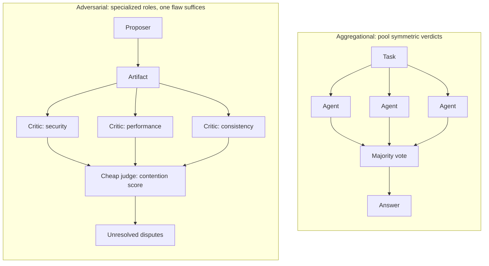

# Multi-Agent Systems {#sec-multi-agent-systems}

A single agent (@sec-agent-architectures) has one viewpoint and one set of
blind spots. Putting several agents on the same task promises to cover those
blind spots, and the default way to cash that promise is to vote. By the end
of this chapter a reader can explain why voting among similar agents buys
less than the math suggests, why structured disagreement buys more, and how
to tell the two failure modes apart so a system escalates the recoverable
ones and blocks the silent ones.

## Problem

The dominant pattern for making a multi-agent system reliable is to run more
agents and take the consensus: vote across $N$ samples, ensemble across
model families, add a judge. The implicit assumption is that agreement is
evidence and disagreement is noise to be averaged away. That intuition came
from places where it held, statistical estimation, classical fault-tolerant
computing, and machine-learning ensembles trained on independently sampled
data. None of those assumptions survive contact with stochastic agents
driven by large language models. Treating agreement as a proxy for
correctness has three load-bearing problems.

Failures are correlated. Classical Byzantine fault tolerance does not
require probabilistic independence in its theorem; it requires a credible
bound on how many replicas can be faulty at once. The $f < N/3$ threshold is
meaningful only when fewer than a third of replicas can share the same
Byzantine failure mode. Two agents drawing from the same base model, the
same training distribution, and often the same prompt template do not have
independent failure modes. They co-hallucinate. They share the same blind
spots, the same bias toward fluent-sounding wrong answers, the same weakness
on the same inputs. Berdoz et al. measured this directly: valid scalar
consensus among LLM agents drops from 46.6% at $N=4$ to 33.3% at $N=16$ even
without any adversary. Adding agents made it worse, not better.

Agreement is cheap to manufacture. A small amount of conformity pressure, a
leading prompt, or a shared in-context example can drive agents into
convergent but incorrect answers. The Free-MAD work gives a modern version:
in consensus-driven debate, agents that initially produce correct responses
can be pulled toward incorrect ones, and final majority voting can degrade
reasoning performance. When the system is graded on agreement, agents learn
to agree, even when the right move is to flag that they cannot.

Self-evaluation is biased. Panickssery et al. showed LLM judges
systematically favor their own generations, and position bias in pairwise
judges is well documented (@sec-judging-holistic). An ensemble of judges
drawn from the same family inherits the same biases. A verification layer
that is a cheaper echo of the layer it verifies cannot tell you anything you
did not already know. The honest reading is that agreement among similar
models is weak evidence of correctness. It is sometimes evidence of nothing
more than that the input was unambiguous enough for any plausible decoder to
land on the same answer.

## Design

The deeper move is to stop treating disagreement as noise. In an idealized
debate, a single competent honest critic is sufficient to expose a flaw, no
matter how many other critics are lazy or wrong. This asymmetry is the core
design idea, and it inverts the orchestration. Instead of symmetric voters
whose verdicts are pooled, the roles are specialized: a proposer produces an
artifact, independent critics each attack one distinct axis of it, and a
cheap judge adjudicates only the disputed claim.

A small formal contrast makes the asymmetry precise. Let $p_i \in [0, 1]$ be
the probability that critic $i$ catches a flaw on the axis it evaluates, and
let $\rho \in [0, 1]$ be the pairwise correlation between verdicts.

Aggregational verification with $k$ voters under majority vote degrades as
correlation rises. As $\rho \to 1$ the probability a flaw survives the
ensemble approaches the probability that the single shared failure mode
misses it, and adding voters does not help:

$$
\Pr[\text{flaw survives} \mid \rho \to 1] \;\to\; \Pr[\text{shared mode misses flaw}]
$$

Adversarial verification with $k$ independent critics on distinct axes,
where one caught flaw suffices, factors over critics. Under independence this
is exact; any residual positive correlation only raises survival above the
product, so the product is the best case you are buying:

$$
\Pr[\text{flaw survives}] \;=\; \prod_{i=1}^{k} (1 - p_i)
$$

The product only buys something if the $p_i$ cover different ways the
artifact can be wrong. Write $p_i = c_i d_i$, where $c_i$ is the probability
critic $i$ selects the relevant attack surface and $d_i$ is the probability
it turns that surface into a concrete objection. Duplicating critics on the
same surface mostly raises $d_i$ locally; forcing topic diversity raises
coverage, roughly $1 - \prod_i (1 - c_i)$. A single competent honest critic
on the relevant axis, $p_i = 1$, collapses the product to zero. This is the
asymmetry that lets adversarial verification dominate consensus when
failures are correlated and at least one independent honest critic exists.

Disagreement also obeys a monotonicity invariant that voting violates. Let
$U_t$ be the set of unresolved attacks after round $t$, $R_t \subseteq U_t$
the attacks resolved by a fix, concession, or convincing defense, and
$A_{t+1}$ the new attacks introduced next round:

$$
U_{t+1} = (U_t \setminus R_t) \cup A_{t+1}
$$

No unresolved objection disappears because more agents voted against it; it
disappears only by being resolved. Majority aggregation violates this by
design, since a real minority objection can be buried under a larger pile of
shallow agreement. The implication for design is precise: you do not need
every critic to be competent, you need a process that surfaces the competent
objection when it exists and terminates on the contested points rather than
averaging them away. This is closer to proof checking, property testing, and
red-team review than to ensemble prediction. The verifier does not reproduce
the whole artifact; it forces a disputed claim into a witness small enough
for a cheap judge to inspect: a failing test, a vulnerable input, a violated
invariant, a missing citation.

## Evolution

The lineage runs from pooling to structure. The starting point is the
ensemble: independent samples, averaged or voted, which works when the
samples are genuinely independent. Byzantine fault tolerance is the
distributed-systems refinement of that idea, and reading it carefully is
what reveals why the naive translation to agents fails. Two of its
contributions survive translation, and they are the two practitioners tend
to skip.

First, the separation of liveness from safety. A system can fail by
producing the wrong answer, a safety violation, or by failing to produce any
answer at all, a liveness violation. The empirical results above are
striking precisely because LLM consensus failures are mostly liveness
failures: the agents do not converge on a wrong answer, they fail to
converge at all. A liveness failure is recoverable by escalation to a human
or a different model. A safety failure is silent and ships. A system that
collapses both into one accuracy number optimizes the wrong axis. Second,
the recognition that correlated failure is how a fault bound becomes false in
practice. The fix is not more replicas but breaking the correlation:
heterogeneous models, prompts, tooling, and where possible heterogeneous
formulation of the question itself.

From there the line continues into debate. Irving, Christiano and Amodei
framed AI safety as a debate judged by a weaker verifier, and Brown-Cohen,
Irving and Piliouras gave the formal extension: soundness holds under a large
compute asymmetry, where the honest strategy uses polynomial simulation
steps while the dishonest strategy may use exponentially many. The
complexity-theoretic intuition is that under optimal play debate can answer
PSPACE questions, because a judge inspecting only the single disputed leaf
where the players' disagreement bottoms out can verify outcomes it could
never have produced unaided. That is the modern destination of the arc:
specialized adversarial roles with a bounded judge, not a wider pool of
symmetric voters.

::: {.callout-important}
## What's contested
Whether adding agents helps is the live disagreement. The aggregational
camp treats more samples and a majority vote as straightforwardly reliable,
and for genuinely independent agents it is. The measured reality for similar
LLM agents is the opposite: naive consensus degrades with agent count, from
46.6% valid consensus at $N=4$ to 33.3% at $N=16$ in Berdoz et al., and
consensus-driven debate can pull initially correct agents toward wrong
answers. Structured disagreement is the contested fix, and it is contested on
two fronts. Its soundness guarantee assumes at least one independent honest
critic exists and is surfaced, which heterogeneity is supposed to provide but
does not prove. And its own evaluation is thin: that adversarial verification
beats aggregation for stochastic agents is argued from debate theory and
small probes, not yet from a broad benchmark. Treat "run more agents and
vote" as safe only when the agents' failures are genuinely independent, which
for same-family models they are not.
:::

::: {.callout-tip}
## Constraint arrow
The orchestration choice is dictated from below. Because critics drawn from
one base model and training distribution (@sec-model-landscape) share a
failure mode, the $f < N/3$ fault-diversity assumption that voting relies on
is already false before the first round. No amount of same-family replication
restores it. The model layer's homogeneity is what forces heterogeneous
orchestration: different model families, different prompts, different
tooling. A decision that looks like a top-level orchestration preference is
set by a property of the layer underneath it.
:::

## Trade-offs

Structured disagreement is not free, and the boundaries are where the source
is honest about what is unsettled.

- Heterogeneity has a cost worth paying. Mixing critic models, for example
  Codex critics against a Claude proposer, introduces integration
  complexity, provider drift, and a coordination tax. It is also the only
  thing that restores any useful version of the fault diversity the
  verification math requires. There is no known shortcut.
- Cardinality is unknown. One critic per topic is the floor; the ceiling is
  unclear. More critics on the same topic should give diminishing returns
  under correlated failure, but the shape of that curve across model families
  has no clean empirical story yet.
- Protocols drift. A debate that runs too long drifts off the original
  claim, and contention scores can be inflated by stylistic friction rather
  than substantive disagreement. The right termination criterion is unsettled;
  steady-state detection plus a hard round cap catches common cases but is not
  optimal.
- Liveness escalates, safety blocks. A system that distinguishes "the agents
  could not converge" from "the agents converged on the wrong answer" can
  route the first to a human and refuse to ship the second. One that cannot
  tell them apart does the wrong thing on both. This is the payoff of keeping
  the two axes separate rather than collapsing them into a single score, and
  it ties directly into oversight (@sec-oversight-control) and agent
  evaluation (@sec-evaluating-agents).

## Implementation

The protocol that falls out is small. Run a proposer to produce an artifact.
Fork independent critics with no shared context. Each critic picks a distinct
attack topic in its first round, security, performance, internal
consistency, evidence gap, and later critics are told which topics are taken
so they pick something else. Run cross-examination per critic until the
proposer concedes or the critic gives up. Apply any concessions, then surface
only the unresolved disputes, ranked by how long each survived attack.

The judging layer should be cheaper and dumber than the proposing layer; this
is the doubly-efficient debate intuition. If the judge has to be as smart as
the proposer, nothing was bought. A concrete realization keeps no model in
the judge loop at all, scoring each attack by a pure contention count:

$$
\text{score}(a) = \text{rounds\_survived}(a) + \mathbf{1}[\text{re\_attacked}(a)]
$$

Two design properties make this work in practice. Claims need addresses:
every nontrivial claim needs a handle, a file path, test case, source
citation, requirement id, so critics have something concrete to attack and
proposers something concrete to repair. Without addressability the review
collapses into rhetoric. And the critic must reach the proposer through a
verbatim channel, a plain user turn rather than a template that would distort
the proposer's normal defense behavior. The shipped reference for this design
is `agon`, which forks a coding session via Claude Code's `--fork-session`,
runs the cross-examination in the fork, and writes only the unresolved
disputes to disk, leaving the root transcript byte-identical. The research
probe behind it, `agents-verification`, measures liveness and safety on
independent axes across parallel-consensus and sequential-chain experiments
rather than collapsing them into one accuracy number.

## Further reading

- Frédéric Berdoz, Leonardo Rugli, Roger Wattenhofer, "Can AI Agents Agree?", 2026. [arXiv:2603.01213](https://arxiv.org/abs/2603.01213)
- Yu Cui, Hang Fu, Haibin Zhang, Licheng Wang, Cong Zuo, "Free-MAD: Consensus-Free Multi-Agent Debate", 2025. [arXiv:2509.11035](https://arxiv.org/abs/2509.11035)
- Arjun Panickssery, Samuel R. Bowman, Shi Feng, "LLM Evaluators Recognize and Favor Their Own Generations", 2024. [arXiv:2404.13076](https://arxiv.org/abs/2404.13076)
- Lin Shi, Chiyu Ma, Wenhua Liang, Xingjian Diao, Weicheng Ma, Soroush Vosoughi, "Judging the Judges: A Systematic Study of Position Bias in LLM-as-a-Judge", 2025. [ACL 2025](https://aclanthology.org/2025.ijcnlp-long.18/)
- Geoffrey Irving, Paul Christiano, Dario Amodei, "AI safety via debate", 2018. [arXiv:1805.00899](https://arxiv.org/abs/1805.00899)
- Jonah Brown-Cohen, Geoffrey Irving, Georgios Piliouras, "Scalable AI Safety via Doubly-Efficient Debate", 2023. [arXiv:2311.14125](https://arxiv.org/abs/2311.14125)
