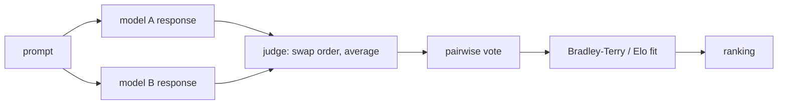

# Judging and Holistic Evaluation {#sec-judging-holistic}

The benchmarks in @sec-benchmarks score what has a checkable answer. Open-ended quality, helpfulness, tone, whether one response is better than another, has no answer key, so the field reaches for a strong model as the grader and for human preference as the ground truth. By the end of this chapter a reader can explain why a model-as-judge is biased and how to correct for it, how arena-style preference ranking turns pairwise votes into a single number, and why a private test set is worth more than any public leaderboard.

## Problem

Most of what a deployed model produces cannot be checked by a test runner. A summary, an explanation, a rewrite, a chat turn: each has many acceptable forms and no reference string to match against. Exact-match and execution graders, the workhorses of @sec-benchmarks, are silent here. The only instruments left are expensive: a human reading every output, or a strong model standing in for that human. Both are biased, and the bias is not random noise that averages out. It is structured, it correlates with the very properties a training run will optimize, and so it bakes itself into the model if you grade against it without correction.

A second problem compounds the first. Any public benchmark, the moment it is published, begins leaking into training corpora and becomes a target to tune toward. A number that everyone can see is a number everyone optimizes, and Goodhart's law takes it from there: the measure stops measuring. So the question is not only how to grade open-ended output, but how to hold a measurement that stays honest after the field has seen it.

## Design

The core idea is to use a strong language model as the grader, the model-as-judge, and to treat its output as a proxy validated against human or executable ground truth, never as ground truth itself. The judge is cheap, fast, and scalable in a way a human panel is not, which is what makes it usable inside a training loop. The price is that it is a biased instrument, and the design is mostly about characterizing and correcting that bias.

Four biases recur, and each maps to a property a model can learn to exploit:

- **Verbosity.** Longer answers score higher, independent of whether the extra length adds anything. A judge optimized against naively rewards padding.
- **Position.** When the judge compares two answers labeled A and B, the order changes the verdict. The same pair, swapped, can flip the winner.
- **Self-preference.** A judge favors outputs from its own model family, so grading a model with a sibling judge inflates its score.
- **Format sensitivity.** Markdown, headers, a confident closing line: surface form moves the score apart from substance.

The mitigations attack each bias directly. For position, swap the order and average the two verdicts, or require agreement across both orderings before calling a winner. For verbosity, normalize for length or instruct the judge to discount it. For self-preference, use a judge from a different family than the model under test, or an ensemble. Across all of them, prefer pairwise comparison over an absolute 1-to-10 score: humans and judges both rank two things more reliably than they place one thing on an abstract scale, and a pairwise protocol sidesteps the question of what a "7" means. Anchor the judge with an explicit rubric rather than a vague "which is better," and calibrate the whole apparatus against human labels on a sample.

Two refinements come from practice. Give the judge an **escape hatch**: let it return "Unknown" when it lacks the evidence to decide, rather than forcing it to manufacture a justification it does not have. And **grade each rubric dimension in isolation**, with its own judge call, rather than asking one call to score correctness, tone, and completeness at once, since a single call lets a strong impression on one axis bleed into the others.

Arena-style preference ranking scales this from a single pairwise verdict to a global ordering. Collect many pairwise comparisons, each a vote that response A beat response B on the same prompt, then fit a rating that explains the votes. The fitting model is the one chess uses, an Elo or Bradley-Terry latent strength per model, so that the probability model $i$ beats model $j$ is

$$
P(i \succ j) = \frac{1}{1 + 10^{(r_j - r_i)/400}}
$$

with $r_i$ the latent rating. Maximum-likelihood fitting over all recorded pairwise outcomes recovers a single ranking from a sparse, noisy set of head-to-head votes. The votes can come from humans (Chatbot Arena, Chiang et al.) or from a model-as-judge (MT-Bench), and the same machinery serves both.

The third leg is the **private test set**: a held-out set you own, that has never appeared in any training mixture, version-pinned, access-controlled, rotated the moment it leaks, and large enough to give a usable signal. A public benchmark you must assume is contaminated over time; a private held-out set is trustworthy only while its integrity holds, and that integrity is an operational property you maintain, not a one-time guarantee.

## Evolution

Open-ended evaluation began with human raters and reference-overlap metrics borrowed from machine translation, neither of which scaled or correlated well with judgment. The model-as-judge emerged once frontier models were strong enough that their preferences tracked human preferences closely on many tasks. Zheng et al. made the case directly: MT-Bench and Chatbot Arena showed that a strong judge agrees with human raters at roughly the rate two humans agree with each other, which is the bar that makes the judge usable as a stand-in.

The biases were characterized in the same period. Wang et al., "Large Language Models are not Fair Evaluators," named the position effect and quantified how much a swap can move a verdict, motivating the swap-and-average protocol that is now standard. Chatbot Arena (Chiang et al.) took the preference-ranking idea to open scale: a public platform collecting human pairwise votes in the wild and publishing a live Elo leaderboard, which became the field's default answer to "which model do people actually prefer," precisely because its inputs are fresh and hard to game by training on a fixed set.

The arc of the private test set runs the other way, away from the public leaderboard. As each published benchmark saturated and contaminated, practitioners learned that the number that survives is the one nobody outside the team has seen. The lesson generalizes the held-out principle from a single train/test split to a discipline: the trustworthy measurement is the fresh, owned, rotated one.

## Trade-offs

- **Judge cost versus reliability.** A stronger judge is more reliable per sample and more expensive per sample; a cheaper judge needs more samples and more aggressive bias correction. Pairwise plus position-swap roughly doubles the judge calls but materially improves reliability. Choose the point on this curve by what the verdict gates: a release decision warrants the expensive protocol, a quick iteration loop may not.
- **Judge versus human.** The judge scales and reproduces; the human is the ground truth that the judge is validated against, but is slow, costly, and itself noisy enough that two annotators disagree. The working compromise is to gate continuously on the judge and calibrate it periodically against a human sample, never letting the judge drift unanchored.
- **Pairwise versus absolute.** Pairwise comparison is more reliable and sidesteps the meaning of an absolute score, but it gives a ranking, not a calibrated number, and the number of comparisons grows with the number of models. Absolute scoring is cheaper to aggregate but more exposed to every bias above.
- **Public versus private sets.** A public benchmark is cheap, comparable across labs, and reproducible, but saturates and contaminates. A private set resists gaming and stays honest but costs effort to build and maintain, cannot be cited for cross-lab comparison, and decays the instant it leaks.

::: {.callout-important}
## What's contested
Whether a model-as-judge is a sound instrument at all is genuinely unsettled. The optimistic position, grounded in the human-agreement rates of Zheng et al., is that a well-calibrated judge with swap-and-average and rubric anchoring is good enough to gate real decisions. The skeptical position is that self-preference and verbosity bias are not fully correctable, that a judge sharing pretraining data with the model under test cannot be neutral, and that optimizing against a judge launders the judge's blind spots into the model. The split also runs through arena ranking: human-vote arenas resist contamination but mix in confounds like answer length and style, and whether the resulting Elo measures capability or a popularity of presentation is debated. The honest stance is that the judge is a useful proxy whose agreement with humans must be measured per task, not assumed.
:::

::: {.callout-tip}
## Constraint arrow
The post-training stage reaches up and sets the judge's job. The preference data that trains a reward model in @sec-rlhf is gathered with exactly the pairwise, position-swapped, rubric-anchored protocol described here, and a reward model is itself a frozen model-as-judge. So the biases catalogued in this chapter are not only an evaluation concern: a verbosity-biased judge that scores a leaderboard is, when distilled into a reward model, a verbosity-biased reward that shapes the model's behavior. The same instrument grades and trains, which is why getting its bias right matters twice.
:::

## Implementation

A judge call is a prompt-engineering problem with a scoring contract on top. The pairwise template presents the prompt and two responses, fixes the rubric, asks for a per-dimension verdict and a winner, and is run twice with the responses swapped; a wrapper averages the two and records both raw verdicts for audit. Keep the rubric explicit and the dimensions separate, and pin the judge model version, since a judge upgrade silently rebases every score and breaks comparability with past runs exactly the way a benchmark version change does.

The ranking fit is small. Given a table of pairwise outcomes, fit a Bradley-Terry model by maximum likelihood, which is a few lines of logistic regression over the win and loss indicators, and report the rating with a bootstrap confidence interval over resampled votes. A rating with no interval is folklore: with a sparse vote matrix the uncertainty on a single model's rank can span several places, and two models inside each other's intervals are not separated by the data.

The private set is an asset with an operational contract. It must never enter a training mixture, so it carries canary strings that let you later detect if it leaked, it is version-pinned and access-controlled, and it is rotated when a leak is found. Build it early and from real failures, the bug tracker and the support queue, since twenty to fifty tasks mined from things the model actually got wrong are worth more than hundreds of synthetic ones, and an eval is harder to reverse-engineer the longer you wait to write it. Whatever the score, do not take it at face value until someone has read the transcripts: a judge that quietly rejects valid answers, or a contaminated number, ships as real signal only because nobody looked.

## Further reading

- Zheng et al., "Judging LLM-as-a-Judge with MT-Bench and Chatbot Arena," 2023. [arXiv:2306.05685](https://arxiv.org/abs/2306.05685)
- Wang et al., "Large Language Models are not Fair Evaluators," 2023 (ACL 2024). [arXiv:2305.17926](https://arxiv.org/abs/2305.17926)
- Chiang et al., "Chatbot Arena: An Open Platform for Evaluating LLMs by Human Preference," 2024 (ICML 2024). [arXiv:2403.04132](https://arxiv.org/abs/2403.04132)
- Liang et al., "Holistic Evaluation of Language Models" (HELM), 2022. [arXiv:2211.09110](https://arxiv.org/abs/2211.09110)
- Shi et al., "Detecting Pretraining Data from Large Language Models," 2023 (ICLR 2024). [arXiv:2310.16789](https://arxiv.org/abs/2310.16789)
- Anthropic, "Demystifying evals for AI agents," 2026 (engineering blog). [anthropic.com](https://www.anthropic.com/engineering/demystifying-evals-for-ai-agents)
