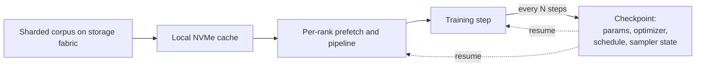

# Orchestration and Data Infrastructure {#sec-orchestration-data-infra}

A frontier run holds thousands of accelerators in lockstep for weeks, and the
hardware underneath it fails on a schedule of its own. This chapter owns the
operational plane that keeps such a run alive and honest: how it checkpoints
against failure, how it streams a multi-trillion-token corpus to every rank
without starving the accelerators or losing reproducibility, what it
instruments to know it is healthy, and how cost and the scheduler shape both.
By the end a reader can explain why checkpoint cadence is an economic decision,
why the data sampler's state belongs in the checkpoint, and why a single dead
node can cost a day.

The accelerators and interconnect this plane runs on are
@sec-accelerators-networking; the parallelism layout it checkpoints and feeds
is @sec-training-at-scale. This chapter owns neither. It owns what happens
between steps and across failures.

## Problem

The compute work of a run, the matmuls and the collectives, is the part that
looks hard, but it is not the part that decides whether the run finishes. At
the scale of thousands of nodes for weeks, failure is the steady state, not the
exception: a GPU falls off the bus, a NIC flaps, a host OOMs, and because the
collectives are gang-scheduled, a single dead participant stalls the entire
job. The operational plane exists to make that survivable and to keep the run
fed and observable while it survives.

Three concrete obligations fall out of this. First, recoverability: when a node
dies, the run must resume from a recent saved state rather than from scratch,
which bounds the wasted work to the gap since the last save. Second, the
data-loading plane must deliver tokens at the rate the accelerators consume
them, honoring the mixture weights set in @sec-data-curation, and it must do so
reproducibly so that a resume continues the exact same data order it would have
seen without the failure. Third, the run must be observable enough that a fault
is caught from telemetry rather than from a quietly wrong loss curve days later.
All three are operational, all three are unglamorous, and all three gate
whether the expensive compute work pays off.

## Design

The core mechanism against failure is the checkpoint: periodically serialize
model parameters, optimizer state, the learning-rate schedule position, and the
data sampler state, so the run can be reconstructed from that snapshot. The
optimizer state dominates the write, since AdamW carries two moment estimates
per parameter, which is the same state @sec-training-at-scale shards across the
data-parallel group. A naive checkpoint stops every rank, writes to storage,
and resumes, putting the full write latency on the critical path. The design
that makes a short cadence affordable removes the write from that path:
*asynchronous* checkpointing copies the tensors to host memory or a staging
buffer and lets training proceed while a background writer drains them to
storage, and *sharded* or *distributed* checkpointing has each rank write only
its own shard of the state in parallel, so write time scales with per-rank
state rather than total state.

The cadence itself is an optimization, not a constant. Checkpoint too rarely
and a failure rolls back a lot of work; checkpoint too often and the writes
themselves tax storage bandwidth and steal time. The optimum balances the
expected work lost per failure against the cost of a write, which is why a
cluster with a lower mean time between failures wants a shorter cadence. A
useful first cut: if failures arrive at rate $\lambda$ and a checkpoint costs
$C$ to write, the interval $T$ that minimizes total wasted time scales like
$T \approx \sqrt{2C/\lambda}$, the familiar square-root tradeoff between save
cost and replay cost.

Recovery is the other half. Elastic restart detects the dead node, fences it
out of the collective, and resumes the survivors from the last checkpoint,
ideally onto pre-warmed spare capacity so the job does not wait for a human or
for the failed host to come back. The harder faults are the ones that do not
crash cleanly: a *straggler* node that runs slow drags every collective down to
its pace, and *silent data corruption* lets the run continue while producing
subtly wrong numbers, which no checkpoint will save you from because the
checkpoint faithfully records the corruption.

The data-loading plane is the second pillar. The corpus is tokenized into many
shards on a high-throughput storage fabric, a parallel filesystem or
NVMe-over-Fabrics tier sized to feed the cluster at multiple TB/s, usually with
a local NVMe cache in front of it. Each rank reads its assigned shards,
prefetches and pipelines the next batch while the current one trains so the
accelerators never wait on I/O, and a global shuffle keeps any single shard's
local correlations from biasing a step. The load order obeys the mixture
weights from @sec-data-curation, which set how often each source is drawn.

The property that ties the data plane back to checkpointing is reproducibility.
A resume must continue the exact data order the run would have followed without
the failure, which means the sampler and shuffle state, the position in the
permutation, the epoch, the per-source draw counters, are part of the
checkpoint, not derived fresh on restart. Without that, a resume re-feeds or
skips data and silently breaks the mixture contract.



Observability is the third pillar, and its design follows from one fact: the
loss curve alone cannot tell you whether the systems work is correct. A run can
be slow, comms-bound, or quietly degraded while the loss still falls. So the
plane instruments the step itself: per-step wall time and its breakdown,
exposed versus overlapped communication, and the grad-norm and loss telemetry
that catch a divergence or a spike early enough to act. The diagnostic unit is
a per-step timeline or profile, not a glance at the loss.

Cost and scheduling sit underneath all of this. Because the collective is
gang-scheduled, the job needs all its nodes simultaneously or none of them make
progress, so the scheduler reserves the gang and keeps spare capacity warm to
absorb a failure without a full restart. Checkpoint cadence, spare-node
provisioning, and the storage-fabric bandwidth are the operational cost knobs,
and they trade directly against the throughput of the run.

## Evolution

Checkpointing for these runs started as the obvious synchronous save: pause,
write everything to a shared filesystem, resume. That was tolerable when models
fit comfortably and clusters were small, but it scaled badly, because both the
state to write and the failure rate grow with the run, so the synchronous write
went from a rounding error to a visible tax. CheckFreq (Mohan et al., 2021) is
the clean statement of the fix: make checkpointing frequent and fine-grained by
pipelining the snapshot and the write so the overhead is low enough that a short
cadence becomes affordable, turning checkpointing from a coarse, costly event
into a routine one. Sharded and distributed checkpointing followed the same
logic into the parallelism layout, letting each rank persist only its own shard
so the write parallelizes across the cluster instead of funneling through one
writer.

The data-loading plane evolved from map-style datasets that index a corpus held
in memory to streaming, sharded pipelines that never materialize the whole
corpus, because a multi-trillion-token corpus does not fit and cannot be
randomly indexed cheaply. The reproducibility requirement arrived with scale
too: at small scale a non-deterministic resume is a nuisance, but at frontier
scale, where resumes are frequent and the mixture contract is load-bearing,
checkpointing the sampler state became non-negotiable.

## Trade-offs

- **Checkpoint cadence.** Frequent checkpoints shrink the work lost per failure
  but tax storage bandwidth and can stall the run; rare checkpoints are cheap to
  write but expensive when a failure hits. Asynchronous and sharded checkpointing
  are what make a short cadence affordable in the first place, and the optimum
  depends on cluster MTBF and write cost, not on a fixed number of steps.
- **Recovery target: storage versus memory.** Writing checkpoints to the storage
  fabric is durable and survives a cluster-wide event but is slow; staging in
  host memory or replicating across peer nodes is fast to write and fast to
  restore but is lost if enough of the cluster goes down at once. The choice
  trades durability against checkpoint cost, and most runs combine a frequent
  cheap tier with an occasional durable one.
- **Reproducibility versus throughput.** Exact data-order reproducibility costs
  determinism overhead: the sampler state must be checkpointed and the shuffle
  must be replayable, which constrains how aggressively you can reorder for I/O
  efficiency. Giving it up buys some throughput but forfeits the ability to
  resume cleanly and to attribute a loss discontinuity to its cause.
- **Spare capacity versus utilization.** Holding warm spare nodes lets an
  elastic restart resume in seconds instead of minutes, but those nodes are paid
  for and idle until a failure uses them. The reservation is insurance whose
  premium is utilization.

::: {.callout-tip}
## Constraint arrow
Checkpoint cadence is dictated from below. The mean time between failures of
the accelerators and interconnect in @sec-accelerators-networking sets how often
the run will be knocked over, and that failure rate, not any property of the
model or the training recipe, is what fixes the economical save interval. A
cluster with flakier hardware must checkpoint more often, which raises storage
bandwidth requirements and lowers effective throughput. An operational choice
that looks like a tuning knob is set by the reliability of the layer beneath it.
:::

::: {.callout-important}
## What's contested
How to checkpoint at frontier scale is unsettled. One camp keeps the durable
write to the storage fabric and works to make it cheap with asynchronous,
sharded snapshots. Another argues that storage is too slow to checkpoint often
enough at this scale and that the answer is in-memory or peer-replicated
checkpointing, keeping recent state in host memory or sharded across redundant
nodes so a restart restores from RAM in seconds, falling back to durable storage
only against a correlated failure. The two imply different cost structures and
different tolerances for correlated failure, and there is no settled default
across frontier stacks.
:::

## Implementation

In practice the operational plane is assembled rather than bought whole. Model
and optimizer sharding come from the parallelism framework, but the checkpoint,
data, and observability planes are frequently custom, because their cadence,
sharding, and resumability must match the exact layout of a given run.

A checkpoint at this scale is not one file. Each rank serializes its shard of
parameters and optimizer state, plus the small but load-bearing scalars: the
step count, the learning-rate schedule position, and the data sampler state. A
sketch of the contract:

```python
state = {
    "model_shard":     shard_of(model.parameters()),
    "optim_shard":     shard_of(optimizer.state),   # dominant term
    "step":            step,
    "lr_schedule_pos": scheduler.position(),
    "sampler_state":   loader.sampler.state_dict(),  # makes resume reproducible
}
async_write(state, path_for(rank, step))             # off the critical path
```

The two failure modes worth naming both surface late and quietly. A node
failure with no recent checkpoint and no fast detection rolls the run back to
its last save and burns the gap as pure waste, which is why detection, fencing,
and a recent checkpoint are one system, not three. A non-reproducible data order
on restart, from a sampler state that was not checkpointed, re-feeds or skips
data and breaks the mixture contract from @sec-data-curation; it shows up as an
unexplained loss discontinuity at every resume and is easy to misread as a
training-recipe problem when it is an operational bug. Both are caught by the
observability the plane installs, and both are prevented by treating the
sampler state and the recovery path as first-class parts of the checkpoint.

## Further reading

- Mohan et al., "CheckFreq: Frequent, Fine-Grained DNN Checkpointing," 2021 (USENIX FAST'21; asynchronous, low-overhead checkpointing). [usenix.org/conference/fast21/presentation/mohan](https://www.usenix.org/conference/fast21/presentation/mohan)
- Zhao et al., "PyTorch FSDP: Experiences on Scaling Fully Sharded Data Parallel," 2023 (VLDB; sharded state that distributed checkpointing persists). [arXiv:2304.11277](https://arxiv.org/abs/2304.11277)
- Rajbhandari et al., "ZeRO: Memory Optimizations Toward Training Trillion Parameter Models," 2019 (sharded optimizer state, the dominant checkpoint term). [arXiv:1910.02054](https://arxiv.org/abs/1910.02054)
