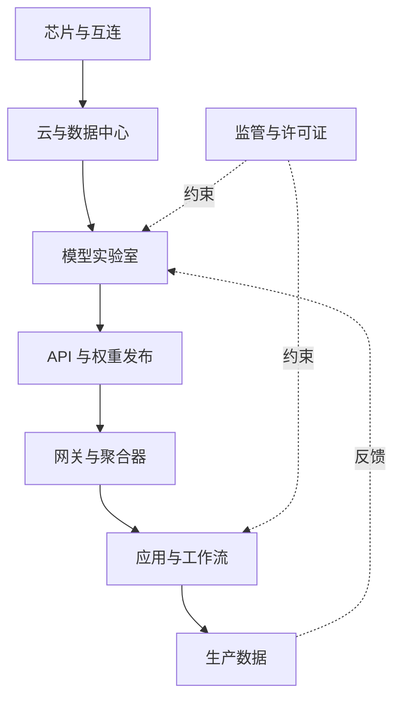

# 第十部分扩增计划：生态与经济

本文档记录第十部分「生态与经济」的扩增方向。它不是正文，不进入 `zh/book.yml`；后续写作时，应逐章拆成英文与中文正文、参考文献、图源和测试。

## 现状判断

第十部分现在有三章：

- `01-model-landscape.qmd`：模型开放程度、权重、许可证、披露维度。
- `02-tooling-ecosystem.qmd`：训练框架、服务引擎、智能体工具层，主要以 Latere 技术栈为案例。
- `03-economics.qmd`：训练与推断成本、自建与购买、每词元成本和盈亏平衡。

这三章足以说明「生态与经济」不是附录，但不足以撑起一个完整 Part。问题不在篇幅，而在解释对象偏窄：现有内容把供给侧的成本账讲得较清楚，却较少解释市场结构、标准形成、数据权利、合规成本和组织采用。第十部分若独立成 Part，应回答的问题是：

> 能力以什么条件被交付，谁控制这些条件，它们怎样反过来改变上游模型设计和下游应用设计。

这个问题横跨模型、工具、市场、法律和组织，因此适合保留为独立部分。扩增后，它应成为第九部分「基础设施、算力与前沿」和第十一部分「实践与运营」之间的经济与产业解释层。

## 建议目标结构

推荐扩为六章。如果希望控制篇幅，可把第六章并入第一章和第四章，形成五章版本。

### 1. 模型版图：开放性、披露与许可证

保留现章主线，但把「开放权重」与「开源 AI」的边界讲得更精确。

应新增的要点：

- 用 OSI 的 Open Source AI Definition 1.0 作为「开源 AI」的正式参照：自由使用、研究、修改、分享，以及数据说明、训练/推断代码、参数三类 preferred form。
- 引入 Model Openness Framework，把开放性从口号变成可评估清单，而不是只看是否下载权重。
- 区分完全开放、开放权重、源码可见、方法披露、仅 API 五档，并说明每档对应的复现、审计、衍生商业生态。
- 补「open washing」或「permissive washing」风险：许可证标签不等于可执行权利，尤其在数据、权重、应用多级供应链中。
- 把现有许可证图升级为「披露产物 × 许可权利 × 可复现性」三维框架。

主要来源：

- Open Source Initiative, The Open Source AI Definition 1.0, 2024. https://opensource.org/ai/open-source-ai-definition
- Matt White et al., “The Model Openness Framework,” 2024. https://arxiv.org/abs/2403.13784
- Adrien Basdevant et al., “Towards a Framework for Openness in Foundation Models,” 2024. https://arxiv.org/abs/2405.15802
- James Jewitt et al., “Permissive-Washing in the Open AI Supply Chain,” 2026. https://arxiv.org/abs/2602.08816
- Shayne Longpre et al., “The Data Provenance Initiative,” 2023. https://arxiv.org/abs/2310.16787

### 2. 标准与工具生态：从框架竞争到互操作层

现有 `02-tooling-ecosystem.qmd` 应重写为更一般的标准与工具生态章。Latere 案例可以保留，但只能作为一个贯穿案例，不能承担整章证据。

应新增的要点：

- 工具生态的控制点不只在框架，也在协议：模型调用、工具调用、智能体间通信、权限、身份、审计。
- MCP 是「AI 应用连接外部系统」的标准化接口，解决的是模型到工具和数据源的互操作。
- A2A 是智能体到智能体的协议层，解决发现、任务管理、消息交换、长任务状态和多供应商协作。
- 协议标准会降低集成成本，也会制造新的安全面：工具投毒、提示注入、权限混淆、跨智能体责任归属。
- 这章应把服务网关、工具注册表、沙箱、agent runtime、观测与授权放进一张分层图，而不是只列工具名。

建议小节：

- 「工具不是插件，而是控制面」
- 「MCP：模型到外部系统」
- 「A2A：智能体到智能体」
- 「标准化降低锁定，也扩大攻击面」
- 「为什么网关、沙箱、审计不能合并成一个框架」

主要来源：

- Model Context Protocol docs, “What is MCP?” https://modelcontextprotocol.io/docs/getting-started/intro
- Google Developers Blog, “Announcing the Agent2Agent Protocol,” 2025. https://developers.googleblog.com/en/a2a-a-new-era-of-agent-interoperability/
- Linux Foundation, “Linux Foundation Launches the Agent2Agent Protocol Project,” 2025. https://www.linuxfoundation.org/press/linux-foundation-launches-the-agent2agent-protocol-project-to-enable-secure-intelligent-communication-between-ai-agents
- Shunyu Yao et al., “ReAct,” 2023. https://arxiv.org/abs/2210.03629
- Anthropic, Model Context Protocol specification and registry. https://modelcontextprotocol.io/

### 3. 算力市场与单位经济学

现有 `03-economics.qmd` 可以保留为本章底稿，但标题和边界应收窄为「算力市场与单位经济学」。它讲的是成本函数，不是全部 AI 经济学。

应新增的要点：

- 训练成本增长来自硬件、互连、人员、实验和最终训练，不只是 GPU 小时。
- 推断价格下降并非单一曲线：经济型和中端模型价格下降更快，旗舰与推理模型有 reasoning premium。
- 自建与购买的盈亏平衡应引入时间项：API 价格下降会把交叉点向右推，自建决策必须按未来价格重算。
- 推断成本公式应区分输入、输出、缓存命中、批量推断、延迟 SLA 与利用率。
- 增加一个「价格不是成本」小节：API 价格包括供应商利润、抢占市场的补贴、捆绑云服务和策略性定价。

建议保留的公式：

$$
\text{cost per token} \approx
\frac{\text{accelerator } \$/\text{hour}}
{\text{throughput (tokens/hour)} \times \text{utilization}}
$$

建议新增的盈亏平衡时间项：

$$
V_t > \frac{F_t}{p_t - c_t}
$$

其中 $p_t$ 是第 $t$ 期 API 单价，$c_t$ 是自有边际成本，$F_t$ 是已投入或即将投入的固定成本。读者应看到，若 $p_t$ 下跌快于 $c_t$，自建门槛会随时间升高。

主要来源：

- Ben Cottier et al., “The rising costs of training frontier AI models,” 2024. https://arxiv.org/abs/2405.21015
- Epoch AI, “How much does it cost to train frontier AI models?” 2024. https://epoch.ai/publications/how-much-does-it-cost-to-train-frontier-ai-models
- Nikhil Sardana et al., “Beyond Chinchilla-Optimal,” 2024. https://arxiv.org/abs/2401.00448
- Mingdeng Du, “Tiered Super-Moore's Law,” 2026. https://arxiv.org/abs/2603.28576
- Stanford HAI, “Artificial Intelligence Index Report 2026.” https://arxiv.org/abs/2606.15708

### 4. 价值链与市场结构

新增章。它应回答「为什么开放模型增强了竞争，却没有自动消除集中」。这章是第十部分最缺的一块。

应覆盖的价值链：

- 芯片与互连：加速器、HBM、网络设备。
- 云与数据中心：容量、供电、预留合同、区域约束。
- 前沿实验室：模型训练、API、权重发布、品牌与安全承诺。
- API 聚合器与网关：路由、价格发现、故障转移、策略层。
- 应用层：分发、用户数据、工作流嵌入、客户预算。

关键论点：

- 前沿模型有自然垄断倾向，但非前沿模型和工具层可能竞争激烈。
- 垂直整合会把模型能力、云容量、分发渠道和企业合规一起打包。
- 开放权重能降低进入门槛，但如果算力、数据、分发和合规仍集中，竞争不会自动扩散。
- 市场结构会反向影响技术路线：低价竞争推动 MoE、量化、缓存、路由和小模型；高端差异化推动长上下文、推理模型和多模态平台。

建议图：

主要来源：

- Jai Vipra and Anton Korinek, “Market Concentration Implications of Foundation Models,” 2023. https://arxiv.org/abs/2311.01550
- Ben Cottier et al., “The rising costs of training frontier AI models,” 2024. https://arxiv.org/abs/2405.21015
- Stanford HAI, “Artificial Intelligence Index Report 2026.” https://arxiv.org/abs/2606.15708
- International Energy Agency, “Energy and AI,” 2025. https://www.iea.org/reports/energy-and-ai

### 5. 采用、生产率与组织改造

新增章。这章应把「模型能做」和「企业得到价值」之间的距离讲清楚。它是第十部分的需求侧。

核心论点：

- AI 的经济价值不是模型分数的直接函数，而是任务边界、质量门槛、工作流重组、责任分配和人的学习曲线的函数。
- 生产率证据呈现强异质性：客服场景有明显收益，咨询任务在能力边界内收益大、边界外会伤害正确性，成熟开源项目中的经验开发者可能被早期工具拖慢。
- 个体工具先改变可独立改变的行为，例如邮件和文档；需要组织协调的会议、审批、任务分配和责任结构变化更慢。
- 真正的经济问题是「谁的时间被节省，节省出来的时间能不能转成产出，错误和复核成本由谁承担」。

建议小节：

- 「能力地平线不是 ROI 地平线」
- 「锯齿状技术边界」
- 「任务、职业与工作流」
- 「复核成本与错误成本」
- 「采用曲线：从个人效率到组织重组」

可用的简化模型：

$$
\Delta \Pi =
V(\Delta Q, \Delta T, \Delta R) -
C_{\text{model}} -
C_{\text{review}} -
C_{\text{integration}} -
C_{\text{errors}}
$$

其中 $\Delta Q$ 是质量变化，$\Delta T$ 是时间变化，$\Delta R$ 是风险变化。这个式子比「节省多少分钟」更接近真实 ROI，因为错误、复核和集成都会吃掉省下的时间。

主要来源：

- Erik Brynjolfsson, Danielle Li, Lindsey Raymond, “Generative AI at Work,” 2023/2024. https://arxiv.org/abs/2304.11771
- Fabrizio Dell'Acqua et al., “Navigating the Jagged Technological Frontier,” 2023. https://www.hbs.edu/faculty/Pages/item.aspx?num=64700
- Joel Becker et al., “Measuring the Impact of Early-2025 AI on Experienced Open-Source Developer Productivity,” 2025. https://arxiv.org/abs/2507.09089
- Eleanor Wiske Dillon et al., “Shifting Work Patterns with Generative AI,” 2025. https://arxiv.org/abs/2504.11436
- Stanford HAI, “Artificial Intelligence Index Report 2026.” https://arxiv.org/abs/2606.15708

### 6. 数据权利、合规与可持续经济

新增章或并入第 1、4 章。若保留独立章，它应从经济角度讲数据和法律，而不是重复第八部分的法规章。

核心论点：

- 数据不是免费自然资源，而是一条会收缩、会被授权、会带来合规成本的供应链。
- 公开网络数据正在出现使用限制、robots.txt 与 Terms of Service 分歧、AI-specific clauses 等新摩擦。
- EU GPAI Code 把透明度、版权、安全与安全保障变成市场准入路径。即使它是自愿工具，签署者也获得更明确的合规路径。
- 数据来源、许可证、模型文档和训练数据摘要会逐渐成为商业采购和部署评审的一部分。
- 能源和水不是本章主线，因为第九部分已有电力与基础设施，但可以作为「外部性进入价格」的小节，引用 IEA 报告。

建议小节：

- 「训练数据作为供应链」
- 「从许可到合规成本」
- 「GPAI Code：透明度、版权、安全」
- 「数据收缩如何改变开放模型」
- 「外部性何时回到账单」

主要来源：

- European Commission, “The General-Purpose AI Code of Practice,” 2025/2026. https://digital-strategy.ec.europa.eu/en/policies/contents-code-gpai
- Shayne Longpre et al., “The Data Provenance Initiative,” 2023. https://arxiv.org/abs/2310.16787
- Shayne Longpre et al., “Consent in Crisis,” 2024. https://arxiv.org/abs/2407.14933
- Open Source Initiative, The Open Source AI Definition 1.0, 2024. https://opensource.org/ai/open-source-ai-definition
- International Energy Agency, “Energy and AI,” 2025. https://www.iea.org/reports/energy-and-ai

## 五章版本

若不希望第十部分膨胀过大，可以采用五章版本：

1. 模型版图：开放性、披露与许可证。
2. 标准与工具生态：MCP、A2A、网关、沙箱、授权、审计。
3. 算力市场与单位经济学：训练、推断、自建与购买。
4. 价值链与市场结构：芯片、云、实验室、聚合器、应用、集中与竞争。
5. 采用与生产率：组织如何把能力变成价值。

在五章版本里，数据权利与合规经济拆入两处：开放定义放进第 1 章，GPAI Code 与数据供应链放进第 4 章。

## 写作顺序

推荐顺序不是按书中顺序，而是按依赖关系：

1. 先改 `03-economics.qmd`，把它收窄为「算力市场与单位经济学」，并补价格下降、reasoning premium、时间化盈亏平衡。
2. 新写「价值链与市场结构」，因为它决定第十部分作为 Part 的必要性。
3. 新写「采用、生产率与组织改造」，补足需求侧。
4. 重写 `02-tooling-ecosystem.qmd`，降低单一案例权重，加入 MCP 与 A2A。
5. 回头增强 `01-model-landscape.qmd`，补 OSI、MOF、数据与许可证。
6. 决定是否独立写「数据权利、合规与可持续经济」。如果不独立，按五章版本合并。

## 每章验收标准

- 每章有一个明确问题，不写成工具清单或行业新闻综述。
- 每章至少 8 至 12 个可核验来源，优先论文、官方标准、法规文本、技术报告。
- 每章至少一个结构图或公式。经济章应保留可运行的小计算；市场结构章应有价值链图；采用章应有 ROI 分解式。
- 每章都要有「争议所在」和「下层约束」或同等功能的小节。
- 中文与英文要同步写，避免中文先行后再硬译。
- 更新对应 `refs/*.bib`，不要把 URL 只塞进正文。
- 写完后运行构建、链接、引用、进一步阅读相关测试。

## 主要风险

- **过时风险。** 价格、模型名、供应商格局变化快。正文应讲机制，数字只作为带日期的例子。
- **营销化风险。** 工具生态章不能变成 Latere 产品说明。案例可以保留，但必须被放在通用框架下。
- **重复风险。** 数据合规不要重复第八部分法规章，能源不要重复第九部分电力章。第十部分只讲这些约束如何进入市场、价格和采用。
- **证据错配风险。** 生产率研究场景差异很大，不能把客服、咨询、开源开发、办公套件的结果合成一个单一结论。
- **定义混乱风险。** 「开放权重」「开放模型」「开源 AI」必须分开，否则会削弱模型版图章的可信度。

## 最小可执行任务列表

1. 新增 `refs/market-structure.bib`，`refs/adoption-productivity.bib`，必要时新增 `refs/data-rights-economics.bib`。
2. 将 `zh/ecosystem/03-economics.qmd` 和 `en/ecosystem/03-economics.qmd` 改名或保留文件名但改章标题为「算力市场与单位经济学」。
3. 新增 `zh/ecosystem/04-market-structure.qmd` 与英文对应章。
4. 新增 `zh/ecosystem/05-adoption-productivity.qmd` 与英文对应章。
5. 视篇幅新增或合并 `06-data-rights-economics.qmd`。
6. 更新 `zh/book.yml` 与 `en/book.yml` 的第十部分章节列表。
7. 更新 `zh/ecosystem/index.qmd` 与 `en/ecosystem/index.qmd`，使 Part 介绍从「三章导览」变成「生态、市场、采用」的总论。
8. 添加或更新图源：市场价值链图、协议互操作图、ROI 分解图、时间化盈亏平衡图。
9. 运行构建与测试，尤其是引用、链接、进一步阅读、图表渲染和中英文结构一致性。
