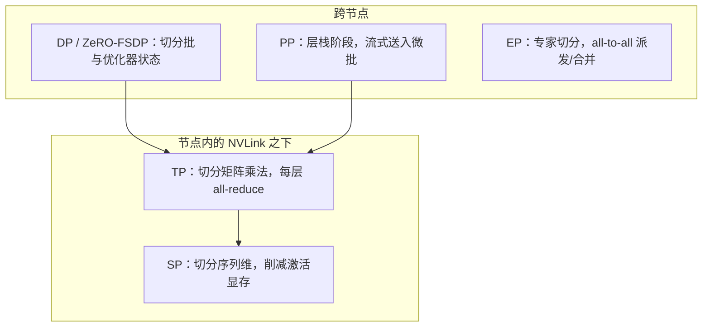

# 大规模训练：稳定性与分布式并行 {#sec-training-at-scale}

一个前沿模型放不进一张加速器，而产出它的训练会横跨数千张加速器、连续运行数周。本章负责
让这次训练快速、数值稳定且可恢复的系统：四个正交的并行轴以及它们如何组合、在不破坏数学
的前提下买来吞吐的精度格式、搬运梯度的集合通信与隐藏它们的重叠，以及让一次训练在自己的
硬件上存活下来的容错。读完本章，读者应能解释：一个设备网格如何为给定的模型形态与互连而
布局、每个并行轴为何落在它所在之处，以及为何 MFU 是说明系统工作是否到位的那个唯一数字。

## 问题

两个事实主导着本章的一切。一个前沿模型的参数、梯度与优化器状态放不进一张设备的显存，而
训练它的算术也无法在一张设备上以任何可接受的时间内完成。于是工作被切分到数千张加速器
上，而一旦切分，三个约束便开始相互角力。

第一个是显存：权重、占主导地位的 Adam 矩估计状态（见 @sec-scaling-laws）、激活与梯度都
必须各得其所，而峰值激活显存随序列长度增长。第二个是通信：每一次切分都引入用于保持各分片
一致的流量，而这些流量与计算争抢同一份时间预算。第三个是故障：在数千个节点上连续运行数周
时，一张失效的 GPU 或网卡是稳态，而非例外，且单单一个就会杀死整个集合通信。训练系统层
的职责，是让显存、通信与恢复彼此权衡，使达成的吞吐保持高位，并让一次故障的代价是数分钟，
而非数日。

## 设计

核心思想是：没有任何单一的切分方式足够，因此设计提供四个正交的轴，各自切掉一种不同的
资源，再把它们组合起来。围绕切分的，还有切分本身带来的两个关切：算术在哪种数值精度下
运行，以及由此产生的通信如何被隐藏在计算之下。

### 四个并行轴

每个轴回答一个不同的扩展问题。

*数据并行（DP）*复制模型并把批切分到各副本；每个副本在自己那一份切片上计算梯度，再由
一次 all-reduce 求平均。朴素的 DP 并不省显存，因为每个副本都持有一份完整副本。ZeRO 及
其 PyTorch 同胞 FSDP 修正了这一点，额外把优化器状态、梯度与参数沿 DP 组切分，从而在不
改变数学的前提下降低每设备显存：一层的参数在被需要之前才 all-gather 取回，用完即刻释放。
这正是 @sec-scaling-laws 在指出优化器状态是占主导的显存项时所引向的那种切分。

*张量并行（TP）*把单层内部的各个矩阵乘法切分，将注意力头与前馈网络的列和行分散到各设备。
它通信密集：每个 TP 层都需要在每一次前向与反向步骤的关键路径上做一次 all-reduce（或一对
reduce-scatter 与 all-gather）。这一代价只有在最快的互连上才用得起，因此 TP 保持在节点内。

*流水线并行（PP）*把层栈拆成若干阶段、放到不同节点上，并把微批流式穿过它们，于是第二阶段
处理第一个微批时，第一阶段已在处理第二个微批。它在带宽上廉价，只搬运各阶段边界处的激活，
但要付一个流水线气泡：每步两端的填充与排空期间，部分阶段处于空闲。

*序列与上下文并行（SP/CP）*沿序列维度切分。SP，如 Korthikanti 等所引入，把一层中被 TP
留作复制的部分（归一化与 dropout）沿序列切分，以削减激活显存；CP，其典范形式是 ring
attention，切分注意力计算本身，使一个对单张设备而言过长的上下文，能以若干块的方式处理，
让键与值的瓦片绕环传递。

对每个轴而言，设计问题都相同：它切分什么、在通信上花费多少，以及它用得起互连的哪一层级。

### 专家并行

混合专家（MoE）层增加了第五个轴。专家被切分到各设备，每个词元由一次 all-to-all 集合通信
派发到它选中的专家，再由第二次 all-to-all 把结果合并回来。系统层只负责这一执行：每个 MoE
层的两次 all-to-all 交换、当一个热门专家吸走超出其份额的词元时引发的负载不均衡掉队节点、
为每个专家的工作量设界的容量填充，以及把派发与合并和专家计算重叠起来。*产生*这一流量模式
的路由决策与负载均衡损失，属于 @sec-moe-ssm-hybrids。

### 精度

算术不必在 fp32 下运行。混合精度把前向与反向的矩阵乘法及激活保持在 bf16，同时持有一份
fp32 的主权重副本与 fp32 的优化器状态，使微小的更新在加到一个大权重上时不至消失。bf16
更宽的指数位正是让这变得安全的原因：它淘汰了 fp16 为把梯度托离其狭窄范围下限所需的损失
缩放。

fp8（E4M3 与 E5M2 格式）在 Hopper 级及更新的硬件上把矩阵乘法推得更远，大致让矩阵乘法
吞吐翻倍、让操作数占用的显存减半。代价是范围：fp8 的指数位太少，操作数必须逐张量、或更细
地重新缩放，才能把数值留在可表示的区间内。它被有选择地应用，矩阵乘法用 fp8，而数值敏感的
算子，即归一化、残差相加与注意力 softmax，则保持在更高精度。推得过远时，fp8 不会崩溃；它
悄悄地损耗质量，这正是它难以用好的原因。

### 集合通信与重叠

每个轴产生的流量都流经一小组集合通信：all-reduce、reduce-scatter、all-gather 与
all-to-all。NCCL（在 AMD 上为 RCCL）实现它们，并把每一个映射到拓扑上，选择环或树算法，
在节点内经由 NVLink、在节点间经由网络来路由。

集合通信纯属开销，除非它们在设备做别的事情时运行，因此重叠是核心的吞吐技巧。FSDP 在当前
层计算时，用一次 all-gather 预取下一层的参数。梯度的 reduce-scatter 与反向传播重叠。PP
通信与阶段计算重叠。EP 的 all-to-all 与专家矩阵乘法重叠。任何无法被隐藏的，都是暴露的
通信，并直接表现为损失掉的吞吐。

### MFU，记分牌

MFU（模型 FLOPs 利用率）衡量重叠是否奏效。它是达成的 FLOPs 除以硬件峰值 FLOPs，只计入
模型在数学上所需的那些 FLOPs。它有别于 HFU（硬件 FLOPs 利用率），后者还计入激活重算的
冗余 FLOPs，因此只要开启重算，HFU 就超过 MFU。MFU 是说明系统工作是否到位的那个唯一
数字，而它的预算是一笔损失之和：暴露的通信、流水线气泡、重算与未融合的内核各占一份。MFU
偏低要靠每步的时间线来诊断，而非靠损失曲线。

## 演化

这套工具箱是一个轴一个轴地到来的，每一个都回应了上一代撞上的一堵墙。

张量并行最先出现。Megatron-LM（Shoeybi 等，2019）展示了如何用每层仅两次 all-reduce 把
Transformer 的矩阵乘法切分到各 GPU 上，使一个数十亿参数的模型在不再能放进单张设备时仍可
训练。流水线并行同期到来：GPipe（Huang 等，2019）把层栈拆成阶段，并用微批让它们保持忙碌，
而 PipeDream（Narayanan 等，2019）把调度推广，以削减气泡。

随后，数据并行学会了省显存。ZeRO（Rajbhandari 等，2019）观察到标准 DP 中的优化器状态、
梯度与参数被冗余地复制，便把它们沿 DP 组分三个递进阶段切分；ZeRO-Infinity（2021）把这一
思想扩展到卸载至 CPU 与 NVMe，而 PyTorch FSDP（Zhao 等，2023）把切分 DP 做成了一个
原生、顺手的原语。接着，激活显存得到了自己的轴：Korthikanti 等（2022）引入了序列并行，连同
选择性重算，只重算那些重做廉价、占显存大的算子，而非整层。

到 2021 年，各轴被刻意地组合。Narayanan 等的 PTD-P 工作把数据、张量与流水线并行作为一个
组合的 3D 布局映射到单个 GPU 集群上，确立了前沿训练至今仍遵循的排序。长上下文随后驱动了
上下文并行的注意力：ring attention（Liu 等，2023）把序列切分到各设备，并让键与值的块绕环
流动，使上下文能近乎无界地增长。在精度轴上，混合精度训练（Micikevicius 等，2017）确立了
bf16 加 fp32 主权重的配方，而 fp8 格式论文（Micikevicius 等，2022）为让 fp8 矩阵乘法原生
化的 Hopper 一代定义了 E4M3 与 E5M2。专家并行的 all-to-all 派发，可追溯到 GShard
（Lepikhin 等，2020）。

## 权衡

每个轴花费一种不同的资源，而胜出的布局，是对一个特定模型形态、在一个特定互连上，能把最多
通信隐藏在计算之下的那一个。

- **并行布局及其不可移植性。** TP 削减每设备显存与延迟，但烧掉节点内带宽，因此它以 NVLink
  域为上限。PP 在带宽上廉价，但要付一个流水线气泡，可通过更多微批与交错调度来缓解。DP 与
  ZeRO 扩展批，但优化器状态分片与 all-gather 流量随 DP 度增长。正确的布局不可移植：改变
  模型规模、序列长度或集群，最优点便移动。
- **显存 vs 计算。** 激活/梯度检查点用反向传播中额外的前向 FLOPs，换取更低的峰值激活显存。
  选择性重算只重做那些廉价、占显存大的算子。更多重算让你能塞下更大的模型或更长的序列，代价
  是 MFU，这正是开启重算时 HFU 超过 MFU 的原因。
- **精度 vs 稳定性。** bf16 是安全的默认值，而 fp32 主权重对优化器而言不容妥协。fp8 买来
  吞吐与显存，但收窄范围，因此要逐张量配缩放地应用，并避开敏感算子。推得过远会产生静默的
  质量损失，而非崩溃。
- **检查点频率。** 频繁的检查点缩小每次故障损失的工作量，但加重存储带宽负担并可能拖停运行。
  异步与切分检查点正是让短频率变得用得起的东西，而最优值取决于集群的平均无故障时间与写入
  成本。

::: {.callout-important}
## 争议所在
fp8 在前沿预训练中能被推到多远尚无定论。bf16 是公认的安全默认值，而 fp8 在 Hopper 级硬件
上显然买来吞吐与显存。分歧在于边界：哪些算子可以转到 fp8、缩放必须多细，以及一次训练能在
fp8 下持续多少万亿词元，才不至于因收窄的范围而损耗最终质量。让这一点难以靠经验定论的，正是
它的失效模式：fp8 推得过远不会崩溃，而是悄悄劣化模型，于是代价在一次靠后的评估之前是隐形的。
把 fp8 的边界当作一个逐算子、逐配方、必须验证的选择，而非一个你可以照搬的设定。
:::

::: {.callout-tip}
## 约束箭头
互连决定并行布局。张量并行需要在每一层的关键路径上做一次 all-reduce，而这只有在最快的链路
上才用得起，因此 NVLink 域的大小设定了最大的 TP 组；超出它，TP 流量便跨上网络并卡顿。
搬运更少、且能隐藏通信的流水线并行与数据并行，才是跨节点的轴，而专家并行获得自己的
all-to-all 组。因此 @sec-accelerators-networking 的带宽层级，位于本章每一个网格决策的上游：
下层的线缆决定了上层可以在何处使用哪种切分。
:::

## 实现

### 组合各轴

一次前沿训练把设备网格映射为各轴之积，惯例为（DP x TP x PP），对于 MoE 再加上 EP，并把
SP 叠加在 TP 之上。排序的经验法则直接源自约束箭头：把 TP 置于节点内的 NVLink 之下，把 PP
与 DP 跑在节点间它们更廉价的通信能被隐藏之处，并给 EP 自己的 all-to-all 组。布局与来自
@sec-transformer-architecture 和 @sec-moe-ssm-hybrids 的模型形态协同设计，并随模型规模、
序列长度与互连而变化。

### 框架

各框架的差异，主要在于每种让哪种布局与哪种硬件用起来更顺手。Megatron-LM 与 Megatron-Core
在 NVIDIA 技术栈上承载 TP、PP、SP 与 EP。DeepSpeed 打包了 ZeRO 与卸载。PyTorch FSDP
是原生的切分 DP。JAX 与 XLA 在 TPU 上把切分表达为 GSPMD 风格的注解（Xu 等，2021），其中
JAX 的 `pjit` 接口驱动分区器。实践中，前沿技术栈会组合多个部件，例如 Megatron-Core 负责
模型并行，加上自研的数据与检查点层。

### 容错

在数千个节点上连续运行数周时，恢复是一个一等子系统。检查点频率由写入成本与每次故障损失的
工作量之间的权衡设定；异步与切分检查点，如 CheckFreq（Mohan 等，2021），把写入挪出关键
路径，使短频率得以负担。弹性重启检测到一个失效节点、将其隔离，并从最近的检查点恢复，理想
情况下落到备用容量上而无需整体重启。掉队节点与静默数据损坏比干净的崩溃更棘手，因为运行
还在继续，却很慢或悄悄出错。

有一个容错关切伸入了数据层：一次重启必须恢复完全相同的数据顺序，这意味着采样器与打乱状态
是检查点的一部分。没有它，一次恢复会重喂或跳过数据，破坏来自 @sec-data-curation 的配比
契约，表现为每次重启时出现一段无法解释的损失不连续。流式送出语料的存储底座，以及调度训练
的集群编排，位于 @sec-orchestration-data-infra；留在此处的，是可恢复性契约这一块。

### 失效模式

症状成簇出现。MFU 偏低是包罗万象的那个，靠每步剖析追溯到暴露的通信、过大的气泡、过多的
重算，或未融合的内核。通信瓶颈意味着限制者是网络：TP 溢出 NVLink 域、一次无法隐藏在反向
传播之下的 DP all-gather，或 MoE 的 all-to-all 卡在一个热门专家上。OOM 意味着对预算而言
布局错误：长序列长度下的激活显存、优化器状态切分不足，或只在某个微批数量下才出现的碎片化
悬崖。一次没有快速检测、隔离与新近检查点的节点故障，会把运行回滚到最近一次保存，那段间隔
是纯粹的浪费。

配方层面的稳定性，即让优化器不发散的 z-loss、QK-norm 与损失尖峰恢复，属于
@sec-scaling-laws。本章负责的稳定性是数值层面的，由精度选择设定，以及运行层面的，由容错
设定。

## 延伸阅读

- Shoeybi et al., "Megatron-LM: Training Multi-Billion Parameter Language Models Using Model Parallelism," 2019. [arXiv:1909.08053](https://arxiv.org/abs/1909.08053)
- Rajbhandari et al., "ZeRO: Memory Optimizations Toward Training Trillion Parameter Models," 2019. [arXiv:1910.02054](https://arxiv.org/abs/1910.02054)
- Narayanan et al., "Efficient Large-Scale Language Model Training on GPU Clusters Using Megatron-LM," 2021 (SC'21; PTD-P 3D parallelism). [arXiv:2104.04473](https://arxiv.org/abs/2104.04473)
- Korthikanti et al., "Reducing Activation Recomputation in Large Transformer Models," 2022 (sequence parallelism + selective recomputation). [arXiv:2205.05198](https://arxiv.org/abs/2205.05198)
- Huang et al., "GPipe: Efficient Training of Giant Neural Networks using Pipeline Parallelism," 2019 (NeurIPS). [arXiv:1811.06965](https://arxiv.org/abs/1811.06965)
- Narayanan et al., "PipeDream: Generalized Pipeline Parallelism for DNN Training," 2019 (SOSP). [doi:10.1145/3341301.3359646](https://doi.org/10.1145/3341301.3359646)
- Zhao et al., "PyTorch FSDP: Experiences on Scaling Fully Sharded Data Parallel," 2023 (VLDB). [arXiv:2304.11277](https://arxiv.org/abs/2304.11277)
- Rajbhandari et al., "ZeRO-Infinity: Breaking the GPU Memory Wall for Extreme Scale Deep Learning," 2021. [arXiv:2104.07857](https://arxiv.org/abs/2104.07857)
- Micikevicius et al., "Mixed Precision Training," 2017. [arXiv:1710.03740](https://arxiv.org/abs/1710.03740)
- Micikevicius et al., "FP8 Formats for Deep Learning," 2022. [arXiv:2209.05433](https://arxiv.org/abs/2209.05433)
- Dao et al., "FlashAttention: Fast and Memory-Efficient Exact Attention with IO-Awareness," 2022 (kernel-level IO-awareness; also in 03). [arXiv:2205.14135](https://arxiv.org/abs/2205.14135)
- Liu et al., "Ring Attention with Blockwise Transformers for Near-Infinite Context," 2023 (context-parallel attention). [arXiv:2310.01889](https://arxiv.org/abs/2310.01889)
- Lepikhin et al., "GShard: Scaling Giant Models with Conditional Computation and Automatic Sharding," 2020 (expert sharding + all-to-all; also in 04). [arXiv:2006.16668](https://arxiv.org/abs/2006.16668)
- NCCL (NVIDIA Collective Communications Library): optimized inter-GPU collective primitives (all-reduce, all-gather, reduce-scatter, all-to-all) over NVLink/PCIe/InfiniBand. Engineering library, not a single canonical paper. [NVIDIA/nccl](https://github.com/NVIDIA/nccl)
- Mohan et al., "CheckFreq: Frequent, Fine-Grained DNN Checkpointing," 2021 (USENIX FAST'21; asynchronous, low-overhead checkpointing). [usenix.org/conference/fast21/presentation/mohan](https://www.usenix.org/conference/fast21/presentation/mohan)
- Xu et al., "GSPMD: General and Scalable Parallelization for ML Computation Graphs," 2021 (XLA/TPU sharding annotations underlying JAX `pjit`). [arXiv:2105.04663](https://arxiv.org/abs/2105.04663)
