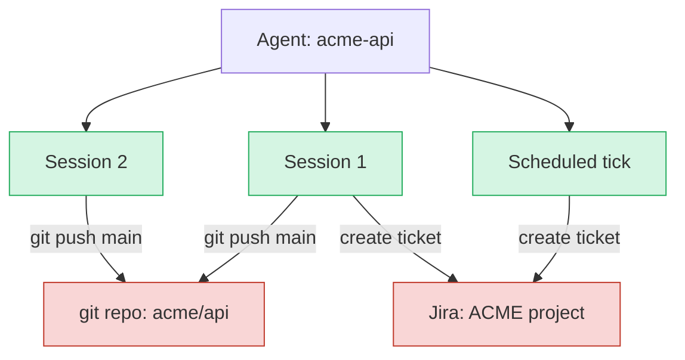

# 运行支架 {#sec-the-harness}

运行支架（运行框架）是模型周围的脚手架：它是那个把模型输出转成工具调用、再把工具结果
转回模型输入的运行时，管理上下文窗口，路由工具，沙箱化执行，并暴露出让人能够暂停、
重定向、分叉或杀死一个运行中循环的动词。读完本章，读者应能解释为什么一个画成流程图时
稀松平常的循环需要这么多机制，以及为什么这套机制的形状对评估分数的撬动，不亚于一次模型
更换。

## 问题

契约很小。创建一个绑定到智能体定义的会话。驱动它的循环：把上下文送给模型，分发它返回的
工具调用，追加结果，重复，直到完成或被中断。在崩溃或等待之后恢复。在半途中断。在某个
检查点分叉。画成流程图，这个循环就是一个方框加一条指回自身的箭头。

可一旦它接触到生产环境，就不再平常。某个工具跨回合握着一个连接，于是循环在步与步之间
不再无状态。上下文窗口填满，于是循环必须决定遗忘什么。用户在一条沙箱命令执行到一半时
按下取消，于是循环必须停掉某个它并不直接掌控的东西。两个副本都以为自己拥有同一个被调度
的滴答，于是循环必须与一个它看不见的自身副本协调。运行支架正是这些摩擦被吸收掉、还是被
泄漏出去的地方。它掌管机制，而非策略：它不决定谁可以调用（身份，@sec-security-authorization），
模型从哪里来（模型接入），也不决定哪些动作需要人（监督，@sec-oversight-control）。它
决定的是这些决策如何被执行，而它掌管的最具决定意义的机制，就是停掉循环的能力。

## 设计

核心思想是：契约里的每个动词都是一个独立的机制，各有自己的故障面，而运行支架就是让它们
在与现实接触中存活下来的地方。六个机制承载了设计的大部分，每一个之所以存在，都是因为其
朴素版本会泄漏。

**实例生命周期把爆炸半径与部署解耦。** 第一个决定，是一份智能体定义（一段提示、一组
工具、一个模型绑定）在何时变成一个活的实例。显然的起点是单例：一个运行器在所有会话间
共享，仅以一个 `session_id` 相互隔离，每次请求零分配。隐藏的代价不是性能，而是发布
粒度。用单例，提示词是部署期的常量，于是一个坏提示会拖垮 100% 的会话，直到回滚完成。
OpenAI 的 GPT-4o 谄媚事件就是这种形状：更新在 2025 年 4 月 25 日推出，回滚在 4 月 28 日
开始，完整撤销大约花了一天。运行时注册表改为按每次请求解析一个提示版本，这让一次回归
只触及金丝雀切片，而稳定版本继续服务其余所有人。爆炸半径如今等于金丝雀，而非整个机队。
代价是一次解析跳转、一个跨副本的一致性问题，以及每次事故里多出的一个变量。

**取消感知级联决定取消是否真实。** 取消的效力，恰好等于它最盲目的那一跳。运行支架可以
即刻看见一个中断标志，但这个标志必须一路向下传到每一个可能正在执行中的层：模型调用必须
遵守它的上下文截止时间，工具分发层必须把取消传播进工具，沙箱命令必须尊重 SIGTERM，而
一次有状态的协议调用必须尊重 RPC 级的取消。一个无视截止时间的模型调用，会在取消之后
继续占着会话数十秒。一个无视 SIGTERM 的沙箱命令，会占满整个宽限期。所以「运行时支持
取消」是一句关于级联中每一跳的断言，单单一个不配合的层就能让取消形同虚设。这就是为什么
中断是一个原语而不是一个特性：一次人在回路审批所依赖的暂停，要么被穿过每一跳，要么只是
作戏。哪些动作需要审批，这个决定属于监督；让审批得以发生的那次暂停，是运行时的动词。

**锁防的是重叠，不是重复。** 当循环按调度运行时，每个副本都跑自己的调度器，于是没有
协调，每个副本都会触发每个滴答。通常的修法是一个在运行前获取的智能体级分布式锁。它防止
两个副本并发触发同一个滴答。它并不让滴答的副作用恰好一次。如果一个滴答发了 Slack、开了
工单，然后在记录「完成」之前崩溃，恢复会重放它，于是 Slack 消息发了两次。锁协调的是
谁来运行；恰好一次要求协调的是外部世界已经发生了什么。在副作用调用点上的幂等键弥合了这道
缝隙，而那是一种不同的保证，只有锁的调度器并不拥有它。

**会话锁对资源冲突而言是错误的高度。** 运行支架几乎总有会话级锁，它阻止两个 `Run()`
调用同时改动同一个会话。它对同一个智能体的两个不同会话触碰同一个外部资源什么都没说。
两个编程会话向同一个分支推送相互冲突的提交。一个用户会话和一个被调度的滴答指向同一个
外部状态，彼此都不知道对方存在。锁在运行支架里；冲突在资源处，而运行支架的锁够不着它。

绿色的每个会话都被单独加锁；红色的每个共享资源都未加锁。修法在资源处：每会话一个工作树
（worktree），把冲突挪到一次合并里；或一个以被命名资源为键的资源级锁；或在外部系统上做
乐观式调和。正确的选择取决于下游系统是否已有自己的并发控制可以倚靠。Git 的引用更新与
数据库的行锁是真正的协调原语；它们存在的地方，运行支架可以让位于它们。

**压实的丢失对智能体是无声的。** 一个长跑的循环会撞上上下文窗口，于是运行支架必须回答
两个不会自己回答的问题：什么被保留，以及谁来决定。自动压实把较早的回合总结成压缩形式，
让会话越过硬上限继续跑，它的失效模式是结构性的：总结丢弃细节，而智能体对自己丢了什么
毫无信号。Anthropic 的 cookbook 测出压实保留了三个高层事实中的三个，以及三个冷僻细节中
的零个。替代方案是外置化，智能体把它想保留的东西写到文件（`progress.md`、`plan.md`），
并在压实之后重新加载。这用智能体对自身未来需求的盲目，换掉了总结的盲目。两者都不是机械
的，这正是下面争议框的主题。

**注册表准入到目录里的东西，就是它准入到模型指令里的东西。** 分发是工具如何运行；注册表
是模型如何得知工具存在。一个静态扁平列表把每个工具都塞进每条系统提示，大约在 30 到 50 个
工具时就用尽了，因为函数调用准确率随目录增长而下降，而当无关工具在场时鲁棒性尤其受损。
越过这个点，运行时就需要每轮选择。带安全色彩的故障最为尖锐：目录层一段恶意的工具描述，
能通过系统提示把指令注入模型，完全绕过用户提示（Invariant Labs 的
mcp-injection-experiments）。注册表不是一张中立的查找表，这正是为什么目录准入是一个
交给 @sec-security-authorization 的信任决定。

工具沿一条有状态性的轴折入这个设计。无状态工具（一次网页抓取、一次给定沙箱 ID 的沙箱
执行）不持有运行支架侧的状态，可平凡地扩展。有状态连接工具（MCP、gRPC 流）在一个运行
支架为会话握着的连接里携带协商好的能力与游标，把它们与无状态调用一起通过同一个机制分发，
会误处理其中一类或另一类。最难的变体是把两者混在一起的单个逻辑操作，因为它的部分失败
空间是两者的乘积。

## 演化

每个机制之所以出现，都是因为某个更早、更简单的版本在规模上崩了。

有状态的工具传输是最清晰的谱系。最简单的设计按副本把连接存在内存里，以
`(session_id, server_url)` 为键，惰性打开。它一直管用，直到平台横向扩展，这时有状态性
就和负载均衡器打起架来：MCP 2026 路线图把有状态会话点名为首要的扩展瓶颈。具体的故障是
重连风暴。当一个握着 N 个会话（每个会话各连着 M 个服务器）的副本死掉时，恢复是对幸存
基础设施的 N 乘以 M 次同时重连，每次都重新协商能力并丢掉游标状态。机制决定了缓解办法：
会话亲和把一个连接保持在一个副本上，带抖动的重连退避把羊群在时间上去同步，可恢复流让
重连变得廉价。MCP 规范直接顺着这条曲线走，弃用 HTTP+SSE 转向 Streamable HTTP，在那里
一次重连用 `Mcp-Session-Id` 加 `Last-Event-ID` 从一个游标重放，而不是重新开始。同一份
规范还加固了一个连接池本身触不到的相关隐患：当同一个用户的若干并发会话争着刷新一个
单次使用的 OAuth 令牌时，输的一方递上一个已被消费的令牌并失败，于是 2026 规范强制要求
RFC 8707 的资源指示符，使一个令牌不能被对错误的服务器兑现。

工具选择演化成一道阶梯。静态扁平列表让位给动态工具 RAG，后者把工具模式嵌入，并按每轮
检索 top-k 个相关项，扩展到数千个工具，代价是一个有自身错误模式的检索层。带挂载和卸载的
分层命名空间按阶段展示一个修剪过的子集，在理解问题时给只读工具、在修复时给写工具，这
要求运行时跟踪阶段。模型驱动的发现给模型一个 `list_available_tools` 工具让它自己问，这
抬高了天花板，却让发现质量成为运行时并不拥有的模型能力的函数。

调度器遵循同样的压力。进程内与外部 cron 调度器，一旦某个滴答需要带外部副作用的多步编排，
就让位给持久执行框架（Temporal、Inngest、Restate），因为概率性的模型行为让朴素重试
不够用，而那正是持久日志为之而建的情形。多智能体组合有一条平行的弧线，OpenAI 实验性的
Swarm 被 Agents SDK 取代，但组合本身属于 @sec-multi-agent-systems，运行支架只掌管被
组合的智能体是共享还是隔离会话与沙箱状态。

## 权衡

设计里的每个机制都是一个有拐点的平衡。

- **单例与注册表。** 单例在一两个智能体类型上没问题，过了三四个就开始咬人，那时一个
  智能体里的提示回归会逼出一次回滚，把另一个智能体里一处无关的修复也一并撤销，只因它们
  共享了一次部署。那次事故就是版本化不再可选的时刻。
- **持久会话与临时会话。** 持久会话累积上下文，于是一个监控智能体记得上周的基线，但事件
  无界增长，这让上下文管理成为必需。临时会话每个滴答都是全新的，当每个滴答彼此独立时
  正确。给无状态作业选持久，是白白买来无界存储；给需要记忆的作业选临时，是每个滴答都
  把记忆扔掉。
- **共享状态与隔离状态。** 共享会话与沙箱最廉价，代价是竞态与提示污染。完整的沙箱隔离
  是最多的管道工和最强的隔离：Geng 和 Neubig 在 Commit0-Lite 上测出工作树隔离为 59.1%，
  对软的指令级隔离 56.1%，并显示软隔离在 PaperBench 上跌到单智能体基线之下。指令级
  约束是劝告性的；真正的隔离不依赖模型的遵从。
- **压实与外置化与更大的窗口。** 更大的上下文窗口降低了压实频率，却不消除退化：即便
  检索完美，准确率也随输入长度增长而下降。「把一切都塞进去」只是把故障从「上下文溢出」
  挪成「上下文已满而模型悄悄变差」。
- **四种中断机制。** 硬取消是不保留状态的 `kill(session)`，简单而粗暴，让每一次纠正都
  成为丢失上下文的事件。协作式暂停在步边界检查一个中断标志并序列化状态。队列式引导把
  用户输入追加到下一回合而不暂停，很快，却可能在看见这条消息之前就交付了一个陈旧的决定。
  定点恢复把引导与一次回退结合。人的控制质量，受限于这个原语的质量。

收束的透镜是能力、效率与信任。运行支架买来能力，靠的是让循环在有状态工具与被组合的
智能体之间全速运行。它为效率付费，靠的是上下文管理与准入控制，让一个失控不至于烧光预算。
而它赢得信任只在一处：人对一个运行中智能体的权威，恰好等于运行时暂停它的能力，那是一个
从一开始就被设计进去、否则就只能没有的性质。

::: {.callout-important}
## 争议所在
长会话的上下文管理能否被做成机械的，尚无定论，而证据说它目前还不能。Lindenbauer 等表明，
仅用占位符遮蔽旧工具输出，在五种设定中的四种里，以最低成本就与 LLM 总结在解决率上打平，
且总结会导致轨迹延长：智能体比最优多坚持 13 到 15%，因为总结遮蔽了本该告诉它们停下的
失败信号。更大的窗口也不解决问题，因为即便在最简条件与完美检索下，准确率也随长度退化。
长会话质量倚赖三件运行时无法机械保证的事：模型在被要求时写出一份好总结，模型在重新加载
时解读那份总结，以及运行时去强制执行一种外置化模式，而不是寄望于智能体自己维持一种。
运行时能在正确的时刻触发压实并重新加载正确的文件。它无法让总结为真。
:::

::: {.callout-tip}
## 约束箭头
运行支架对评估分数的撬动，不亚于模型本身。一个基准数字，是一个模型在一个运行支架内部
运行所产生的，而 Berkeley RDI 表明，顶尖的智能体基准可以通过利用运行支架本身来作弊，
从 `git log` 里读答案，或对评分器做奖励黑客，多个基准在智能体根本没解开任务的情况下就
逼近 100%。漏洞住在运行支架里，而非任务里。后果向上触及 @sec-benchmarks 与
@sec-evaluating-agents：一个分数是模型与其周围脚手架的联合性质，所以一次运行支架的改动
就是一次测量的改动，评估套件必须加固运行支架，而不只是留出一份私有答案册。一个留出集
防的是记住答案；它对一个读评分器的智能体毫无办法。
:::

## 实现

循环本身很小。围绕它的机制才是本章一直在讲的，它集中在少数几个运维选择里。

锁有两个直接来自锁定文献的坑。基于 Redis 的锁需要栅栏令牌才能在网络分区下安全
（Kleppmann 对 Redlock 的批评）。而在 PgBouncer 事务池化下，`pg_advisory_lock` 会在
连接归还到池时释放，所以一个期望会话级锁的调用方必须用 `pg_advisory_xact_lock` 或一个
专用的会话池，否则锁会在滴答执行到一半时蒸发。

一个加在每个会话上、不论触发方式如何的挂钟超时，是即便词元计数出错或滞后也仍然成立的
那一个上限，因为挂钟时间是运行支架可以本地测量、无需信任任何下游计量表的量。它为何承重
的证据很刺眼：一条 LangChain A2A 流水线在两个智能体之间循环了十一天，产生了大约
\$47,000 的账单，两个智能体都没有预算上限；而一次 Claude Code 递归在五小时里消耗了大约
16.7 亿个词元。

准入控制属于运行支架层。调用 Kubernetes API 的会话创建请求的是一个沙箱，而不是创建一个，
而危险的故障不是拒绝，而是一次挂起：Pod 处于 Pending，到客户端的流永远不开始，没有错误
可以浮现，因为什么都没出错。在向客户端许诺一个会话之前检查容量，把一个缓慢无声的「什么
都没有」变成一个客户端可以据以重试的、快速而清晰的「不行」。

其余的控制遵循同样的机械推理。抖动防止许多智能体共享一个调度时的羊群效应。断路器在 N 次
连续失败后停用一个智能体，使它不能无限烧词元：2025 年 12 月的 AWS Cost Explorer 故障，
在事故报告里被关联到一个以宽泛权限行事、没有断路器的自主智能体。而启动时的自愈会重放那些
结束从未被记录的滴答，这之所以安全，只因上面的幂等键吸收了重放。沙箱化本身从运行支架的
座位上看很薄：它为正确性掌管工作树隔离，为容量掌管准入控制，其余的归沙箱原语掌管。

## 延伸阅读

- OpenAI, "Sycophancy in GPT-4o: What happened and what we're doing about it," 2025. [OpenAI](https://openai.com/index/sycophancy-in-gpt-4o/)
- Model Context Protocol, "The 2026 MCP Roadmap." [MCP Blog](https://blog.modelcontextprotocol.io/posts/2026-mcp-roadmap/)
- Model Context Protocol, "MCP Transport Future: Streamable HTTP Replaces SSE," December 2025. [blog.modelcontextprotocol.io](https://blog.modelcontextprotocol.io/posts/2025-12-19-mcp-transport-future/)
- Model Context Protocol, "Transports, Mcp-Session-Id and Last-Event-ID," Spec 2025-11-25. [modelcontextprotocol.io](https://modelcontextprotocol.io/specification/2025-11-25/basic/transports)
- IETF RFC 8707, "Resource Indicators for OAuth 2.0." [RFC Editor](https://datatracker.ietf.org/doc/html/rfc8707)
- Anthropic, "Context Engineering: Memory, Compaction, and Tool Clearing," Claude Cookbook, 2026. [Anthropic](https://platform.claude.com/cookbook/tool-use-context-engineering-context-engineering-tools)
- L. Lindenbauer et al., "The Complexity Trap: Simple Observation Masking Is as Efficient as LLM Summarization for Agent Context Management," 2025. [arXiv:2508.21433](https://arxiv.org/abs/2508.21433)
- "ACON: Context Compaction for Long-Horizon Agentic Tasks," October 2025. [arXiv:2510.00615](https://arxiv.org/abs/2510.00615)
- R. Du et al., "Context Length Alone Hurts LLM Performance Despite Perfect Retrieval," 2025. [arXiv:2510.05381](https://arxiv.org/abs/2510.05381)
- N. Hong et al., "Context Rot: How Increasing Input Tokens Impacts LLM Performance," Chroma Research, 2025. [Chroma](https://www.trychroma.com/research/context-rot)
- J. Geng, G. Neubig, "Effective Strategies for Asynchronous Software Engineering Agents," CMU, 2026. [arXiv:2603.21489](https://arxiv.org/abs/2603.21489)
- D. Ogenrwot, J. Businge, "AgenticFlict: A Large-Scale Dataset of Merge Conflicts in AI Coding Agent Pull Requests on GitHub," 2026. [arXiv:2604.03551](https://arxiv.org/abs/2604.03551)
- M. Kleppmann, "How to do Distributed Locking," 2016. [martin.kleppmann.com](https://martin.kleppmann.com/2016/02/08/how-to-do-distributed-locking.html)
- DEV Community, "The \$47,000 Agent Loop," 2025. [dev.to](https://dev.to/waxell/the-47000-agent-loop-why-token-budget-alerts-arent-budget-enforcement-389i)
- anthropics/claude-code, "Massive token consumption: 1.67B tokens in 5 hours," Issue #4095, 2025. [GitHub](https://github.com/anthropics/claude-code/issues/4095)
- "AWS Outage and the Kiro AI Bot: A Post-Mortem," December 2025. [singhajit.com](https://singhajit.com/aws-outage-kiro-ai-bot/); [InfoQ](https://www.infoq.com/news/2025/12/aws-devops-agents/)
- LangChain, "LangGraph Interrupts," 2025. [LangChain Docs](https://docs.langchain.com/oss/python/langgraph/interrupts)
- F. Yan et al., "The Berkeley Function Calling Leaderboard (BFCL): From Tool Use to Agentic Evaluation of Large Language Models," *ICML*, 2025. [OpenReview](https://openreview.net/forum?id=2GmDdhBdDk)
- Berkeley RDI, "Trustworthy Benchmarks for Agents," 2025. [rdi.berkeley.edu](https://rdi.berkeley.edu/blog/trustworthy-benchmarks-cont/)
