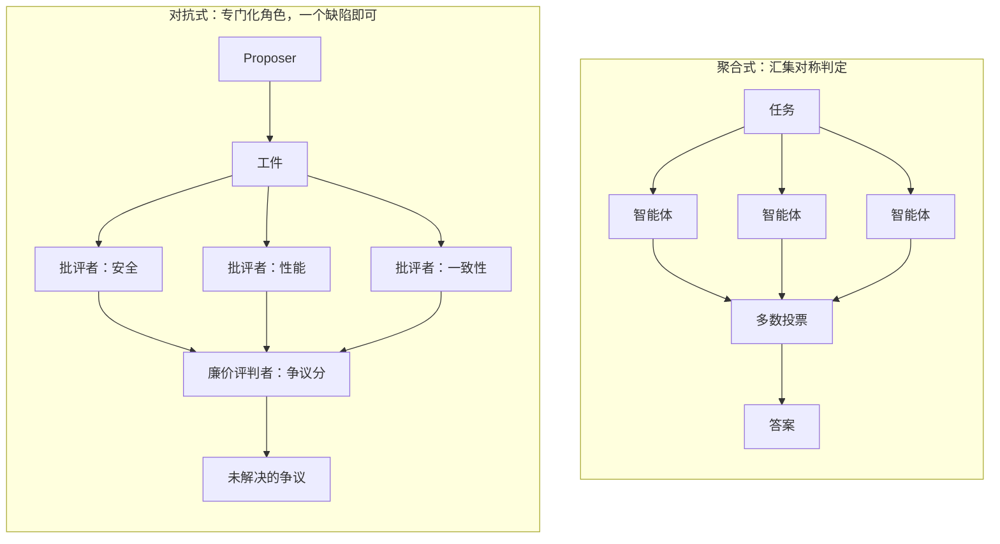

# 多智能体系统 {#sec-multi-agent-systems}

单个智能体（@sec-agent-architectures）只有一个视角和一组盲区。把几个智能体放到同一个
任务上，许诺的是相互覆盖这些盲区，而兑现这一许诺的默认方式是投票。读完本章，读者应能解释
为什么相似智能体之间的投票买到的东西比数学暗示的要少、为什么结构化的分歧买到的更多，以及
如何区分两种失败模式，使系统升级那些可恢复的、阻断那些静默的。

## 问题

让多智能体系统可靠的主流做法是跑更多智能体、取共识：在 $N$ 个采样上投票，在不同模型家族
间做集成，再加一个评判者。其隐含假设是：一致即是证据，分歧即是噪声，应当被平均掉。这种
直觉来自它原本成立的场景：统计估计、经典容错计算，以及在独立采样数据上训练的机器学习集成。
这些假设没有一个能在与大语言模型驱动的随机智能体接触后幸存。把一致当作正确性的代理，有三个
承重的问题。

失败是相关的。经典拜占庭容错的定理并不要求概率意义上的独立；它要求你能可信地界定同时故障
的副本数量。$f < N/3$ 这条阈值只有在少于三分之一副本会共享同一个拜占庭失败模式时才有意义。
两个智能体如果取自同一个基础模型、同一个训练分布，往往还共用同一个提示模板，它们的失败
模式并不独立。它们会共同幻觉。它们共享同样的盲区、同样偏向"听起来流畅却错误"的答案的偏置、
在同类输入上同样的弱点。Berdoz 等人直接测量了这一点：在没有任何对手的情况下，LLM 智能体
的有效标量共识率从 $N=4$ 时的 46.6% 下降到 $N=16$ 时的 33.3%。增加智能体只会让结果
更糟，没有带来改善。

一致很容易被人为制造。少量的从众压力、一个引导性提示、或者一个共享的上下文示例，就足以把
智能体推向收敛但错误的答案。Free-MAD 工作给出了一个现代版本：在共识驱动的辩论中，最初
给出正确回答的智能体可能被错误回答拉偏，而最后一轮多数投票可能降低推理性能。当系统以"是否
一致"被打分时，智能体就学会了一致，哪怕正确的做法是表明它们无法一致。

自评是有偏的。Panickssery 等人指出 LLM 评判者会系统性偏爱自己的生成结果，成对评判中的
位置偏置也有充分文献（@sec-judging-holistic）。出自同一家族的评判者集成会继承同样的偏置。
一个只是被验证层廉价回声的验证层，无法告诉你你原本不知道的事。诚实的读法是：相似模型之间
的一致是正确性的弱证据。它有时不过证明了输入足够无歧义，以至于任何合理的解码器都会落到
同一个答案上。

## 设计

更深的一步，是停止把分歧当作噪声。在理想化的辩论里，只要有一位有能力且诚实的批评者，就足以
揭出一个缺陷，无论其他批评者多么懒惰或错误。这种不对称是核心的设计思想，它颠倒了编排。区别
于把判定汇集起来的对称投票者，角色是专门化的：一个 proposer 产出工件，独立的批评者各自攻击
它的一个不同轴，一个廉价的评判者只裁决有争议的那条主张。

一个简明的形式对比让这种不对称变得精确。设 $p_i \in [0, 1]$ 为批评者 $i$ 在其负责的轴上
发现缺陷的概率，$\rho \in [0, 1]$ 为判定结果之间的两两相关性。

聚合式验证：$k$ 个 voter 做多数投票，会随相关性升高而退化。当 $\rho \to 1$ 时，缺陷在
集成中存活的概率趋向于那个唯一的共同失败模式漏掉它的概率，增加 voter 无济于事：

$$
\Pr[\text{flaw survives} \mid \rho \to 1] \;\to\; \Pr[\text{shared mode misses flaw}]
$$

对抗式验证：$k$ 位独立批评者覆盖不同轴，发现一个缺陷即可，存活概率在批评者上分解为乘积。
在独立的前提下这是精确的；任何残余的正相关只会把存活概率抬高到乘积之上，因此这个乘积是你
能买到的最好情况：

$$
\Pr[\text{flaw survives}] \;=\; \prod_{i=1}^{k} (1 - p_i)
$$

这个乘积只有在 $p_i$ 覆盖不同错误方式时才有意义。写作 $p_i = c_i d_i$，其中 $c_i$ 是
批评者 $i$ 选中相关攻击面的概率，$d_i$ 是它把这个攻击面推进成具体反对意见的概率。重复同一
攻击面的批评者主要是在局部提高 $d_i$；强制话题多样性提高的是覆盖率，近似为
$1 - \prod_i (1 - c_i)$。只要在相关轴上有一位有能力且诚实的批评者，$p_i = 1$，整个乘积
坍缩为零。当失败相关且至少存在一位独立诚实的批评者时，正是这种不对称使对抗式验证可能压倒
共识。

分歧还服从一个投票所违反的单调性不变量。设 $U_t$ 为第 $t$ 轮之后未解决攻击的集合，
$R_t \subseteq U_t$ 为通过修复、让步或令人信服的辩护而被解决的攻击，$A_{t+1}$ 为下一轮
引入的新攻击：

$$
U_{t+1} = (U_t \setminus R_t) \cup A_{t+1}
$$

未解决的反对意见不会因为更多智能体投票反对它而消失；它只有在被解决之后才会消失。多数聚合
在设计上违反了这一点，因为一个真实的少数派反对意见可能被一大堆浅层一致掩埋。对设计的含义
是精确的：你并不需要每位批评者都有能力，你需要的是一个流程，当存在有能力的反对意见时把它
浮出来，并在争议点上终止，避免把它们平均掉。这更接近证明检查、性质测试和红队审查，区别于
集成预测。验证者不复现整个工件；它把一个有争议的主张压缩成足够小的证据，让一个廉价的评判者
可以检查：一个失败测试、一个易受攻击的输入、一个被违反的不变量、一条缺失的引用。

## 演化

这条谱系从汇集走向结构。起点是集成：独立采样，做平均或投票，在采样真正独立时有效。拜占庭
容错是这一思想在分布式系统里的精化，而仔细读它，正是揭示为什么朴素地翻译到智能体会失败的
原因。它有两条贡献在被翻译之后依然成立，而它们恰好是从业者最容易跳过的两条。

第一，活性与安全性的分离。一个系统可以以错误答案的方式失败，即违反安全性，也可以以根本
无法给出答案的方式失败，即违反活性。前文的实证结果之所以耀眼，正因为 LLM 共识失败大多是
活性失败：智能体并未收敛到错误答案，它们根本无法收敛。活性失败可以通过升级到人类或换一个
模型来恢复。安全性失败是静默的、会发布出去的。把两者坍缩为一个准确率的系统会优化错误的轴。
第二，承认相关失败会让故障界限在实践中失效。补救方案不是更多副本，而是打破相关性：异构
模型、异构提示、异构工具，必要时还要异构地重述问题本身。

由此这条线继续走向辩论。Irving、Christiano 与 Amodei 把 AI 安全构造为一场由较弱验证者
裁决的辩论，而 Brown-Cohen、Irving 与 Piliouras 给出了形式化扩展：在很大的算力不对称下
soundness 仍成立，其中诚实策略只使用多项式步数的模拟，而不诚实策略可以使用指数级步数。其
复杂度直觉是：在最优博弈下辩论可以回答 PSPACE 问题，因为一个仅审视玩家分歧最终落到的那个
争议叶子的评判者，能验证它本来无法独力产生的结论。这就是这条弧线的现代终点：带有界评判者的
专门化对抗角色，而非更宽的对称投票者池。

::: {.callout-important}
## 争议所在
增加智能体是否有帮助，是这里活跃的分歧。聚合阵营把更多采样加多数投票视为直截了当地可靠，
对真正独立的智能体而言它确实如此。但相似 LLM 智能体的实测现实正好相反：朴素共识随智能体
数量退化，在 Berdoz 等人那里从 $N=4$ 时的 46.6% 有效共识降到 $N=16$ 时的 33.3%，而
共识驱动的辩论能把最初正确的智能体拉向错误答案。结构化的分歧是有争议的补救，而它在两条
战线上都有争议。它的 soundness 保证假设至少存在一位独立诚实的批评者并被浮出来，异构本应
提供这一点却无法证明。而它自身的评估仍是单薄的：对随机智能体而言对抗式验证胜过聚合，是从
辩论理论与小规模探针论证出来的，尚无一个宽广的基准。只有当智能体的失败真正独立时，才把
"跑更多智能体、投票"当作安全的；对同一家族的模型而言，它们并不独立。
:::

::: {.callout-tip}
## 约束箭头
编排选择是从下层被规定的。因为取自同一个基础模型与训练分布（@sec-model-landscape）的
批评者共享一个失败模式，投票所依赖的 $f < N/3$ 故障多样性假设，在第一轮之前就已经为假。
任何同一家族的复制都无法恢复它。模型层的同质性，正是迫使编排走向异构的原因：不同模型家族、
不同提示、不同工具。一个看似顶层编排偏好的决策，是由它下面那一层的性质所设定的。
:::

## 权衡

结构化的分歧并不免费，而其边界正是源材料对尚未定论之处诚实的地方。

- 异构是值得付的成本。混合不同的批评者模型，例如给 Claude proposer 配 Codex 批评者，会
  引入集成复杂度、跨厂商漂移与协调税。它也是唯一能恢复验证数学所需要的某种有用故障多样性
  的东西。没有已知的捷径。
- 基数是未知的。每个话题一位批评者是下限；上限不清楚。在相关失败之下，同一话题上加更多
  批评者应当只买到边际收益，但这条曲线跨模型家族的样子，还没有一个干净的实证叙事。
- 协议会漂移。一场跑得太久的辩论会偏离原始主张，争议分也可能被风格摩擦抬高，缺少实质分歧。
  正确的终止判据尚未定下；稳态检测加硬性轮次上限覆盖了常见情况，但并不最优。
- 活性升级，安全性阻断。一个能区分"智能体无法收敛"与"智能体收敛在错误答案"的系统，可以把
  前者交给人类、拒绝发布后者。区分不出来的系统对两种情况都会做错事。这正是把两条轴分开、
  而非坍缩为单一分数的回报，它直接接入监督（@sec-oversight-control）与智能体评估
  （@sec-evaluating-agents）。

## 实现

由此落出的协议很小。跑一个 proposer 产出工件。分叉出没有共享上下文的独立批评者。每位
批评者在第一轮选一个不同的攻击话题，安全、性能、内部一致性、证据缺口，后来的批评者会被
告知已被占用的话题，从而选别的。对每位批评者运行交叉质询，直到 proposer 让步或批评者
放弃。应用所有让步，然后仅浮出未解决的争议，并按各自在攻击下存活的时长排序。

评判层应当比 proposer 层更廉价、更笨；这是双重高效辩论的直觉。如果评判者必须和 proposer
一样聪明，那就什么都没买到。一个具体实现在评判回路里完全不放模型，用一个纯粹的争议计数
给每个攻击打分：

$$
\text{score}(a) = \text{rounds\_survived}(a) + \mathbf{1}[\text{re\_attacked}(a)]
$$

有两个设计性质让它在实践中奏效。主张需要地址：每个非平凡主张都需要一个句柄，文件路径、
测试用例、来源引用、需求 id，这样批评者有一个具体的攻击对象，proposer 有一个具体的修复
对象。没有可寻址性，审查就会坍缩为修辞。其次，批评者必须通过一个逐字通道到达 proposer，
即一个普通用户回合，而非一个会扭曲 proposer 常规辩护行为的模板。这一设计的已发布参考是
`agon`，它通过 Claude Code 的 `--fork-session` 分叉一次编码会话，在分叉里跑交叉质询，
仅把未解决的争议写入磁盘，使根会话记录逐字节不变。它背后的研究探针 `agents-verification`
把活性与安全性放在独立的轴上、跨并行共识与顺序链实验度量，而非将它们坍缩为单一的准确率。

## 延伸阅读

- Frédéric Berdoz, Leonardo Rugli, Roger Wattenhofer, "Can AI Agents Agree?", 2026. [arXiv:2603.01213](https://arxiv.org/abs/2603.01213)
- Yu Cui, Hang Fu, Haibin Zhang, Licheng Wang, Cong Zuo, "Free-MAD: Consensus-Free Multi-Agent Debate", 2025. [arXiv:2509.11035](https://arxiv.org/abs/2509.11035)
- Arjun Panickssery, Samuel R. Bowman, Shi Feng, "LLM Evaluators Recognize and Favor Their Own Generations", 2024. [arXiv:2404.13076](https://arxiv.org/abs/2404.13076)
- Lin Shi, Chiyu Ma, Wenhua Liang, Xingjian Diao, Weicheng Ma, Soroush Vosoughi, "Judging the Judges: A Systematic Study of Position Bias in LLM-as-a-Judge", 2025. [ACL 2025](https://aclanthology.org/2025.ijcnlp-long.18/)
- Geoffrey Irving, Paul Christiano, Dario Amodei, "AI safety via debate", 2018. [arXiv:1805.00899](https://arxiv.org/abs/1805.00899)
- Jonah Brown-Cohen, Geoffrey Irving, Georgios Piliouras, "Scalable AI Safety via Doubly-Efficient Debate", 2023. [arXiv:2311.14125](https://arxiv.org/abs/2311.14125)
