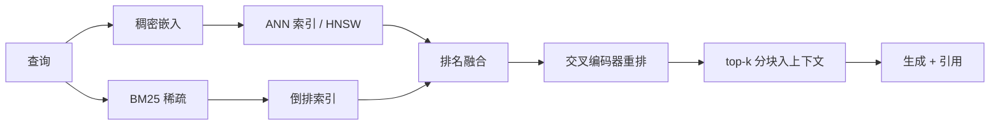

# RAG 与检索 {#sec-rag-retrieval}

模型的权重是它所训练语料的一份有损、冻结的快照。检索增强生成（RAG）把一份实时、可查询的
语料放在模型旁边，并在回答时把恰当的段落喂进提示。读完本章，读者应能解释一个查询如何变成
一组被检索到的分块、为何稠密嵌入、稀疏词项匹配与重排器各自在流水线中赢得一席之地、GraphRAG
与智能体 RAG 如何扩展朴素回路，以及检索在与日益增长的上下文窗口的对峙中争议何在。

## 问题

一个前沿模型知道它的预训练配比里有什么，截至配比被冻结的那一天为止，并被 @sec-scaling-laws
所述的有损压缩所模糊。它不知道你的私有文档，不知道截止日期之后发生了什么，而当被问到一个它
记得一半的事实时，它会产出一个流畅、自信、错误的答案。把知识微调进权重既昂贵、更新又慢，而且
依然有损。更干净的做法是把知识留在权重之外，按需取用。

这把问题重新表述为信息检索与生成的联姻。给定一个问题与一份数百万段落的语料，找出真正回答这个
问题的那一小组段落，把它们放进上下文窗口，让模型读取并引用它们。难点全在检索：语料很大，所以
搜索必须是亚线性的；问题与答案很少共享确切的词，所以单凭词法匹配很脆弱；上下文窗口有限且昂贵，
所以你只能传入少数几个段落，而它们最好是对的。检索就是把一个问题，变成那几百个会改变答案的
证据词元的行为。

## 设计

朴素 RAG 流水线有四个阶段：离线分块并索引语料、在线嵌入查询、检索最近的分块、以它们为条件生成
答案。每个阶段都是为了回答那个否则会取代它的阶段的某个特定失败而存在。

**分块**之所以存在，是因为文档太长，无法整体嵌入或检索。单个向量无法以一个问题所需的粒度表示
一份百页报告，而你也无法把整份报告粘进提示。于是语料被切成分块，通常几百个词元，每个分块被
独立索引。分块大小是一个直接的权衡：分块太大，会把相关的句子稀释在不相关的句子里，并浪费上下文
预算；分块太小，则把句子从消歧它的上下文中切断。重叠窗口与结构感知的切分（按章节、按段落）能
缓和边界问题。

**稠密检索**回答词法匹配的脆弱性。一个双编码器把查询与每个分块嵌入到同一个向量空间，经过训练，
使一个问题与它的答案彼此落得很近，即便它们不共享任何词。Karpukhin 等（2020），即 Dense Passage
Retrieval，表明一个在几千条问题-段落对上训练的双编码器，在开放域 QA 的 top-20 检索准确率上以
很大幅度胜过强 BM25 基线。相关性变成嵌入空间中的一个点积或余弦相似度：

$$
\text{score}(q, c) = \mathbf{E}_q(q) \cdot \mathbf{E}_c(c)
$$

其中 $\mathbf{E}_q$ 与 $\mathbf{E}_c$ 是查询与分块的编码器。这两个编码器可以绑定或分开，而分块
嵌入只在离线时计算一次，然后冻结进索引。

**向量存储**回答搜索的成本。在数百万个分块向量下，为每个查询对每一个都计算点积太慢了。近似最近
邻索引以一个很小、有界的召回损失，换取数量级的速度。占主导的结构是 HNSW，即 Malkov 与 Yashunin
（2018）的分层可导航小世界图，它构建一个多层邻近图，从稀疏的顶层向下贪婪地搜索，给出对数级的
查询时间。一个向量存储就是 HNSW（或其量化变体）加上元数据过滤，再加上让索引与语料保持同步的
管道。

**混合搜索**回答稠密检索的盲点。嵌入能跨改写泛化，却会丢失确切的词元：一个零件号、一个罕见的
名字、一个代码标识符、一个被稠密模型抹平的字面字符串。稀疏词法检索，即倒排索引上的 BM25，对
那些词项是精确的，且互补。混合搜索同时运行两者并融合排名，常用倒数排名融合（reciprocal rank
fusion），使被任一方法排到高位的分块都能浮现。

**重排**回答廉价检索与精确打分之间的落差。双编码器之所以快，是因为查询与分块直到最终的点积之前
都不曾相遇，这也正是它不精确的原因：它无法建模查询的词与分块的词之间的细粒度交互。一个交叉编码器
重排器把查询与分块一起喂过一个 transformer，对它们的联合表示打分，这远更精确，也远太慢，无法在
整个语料上运行。于是流水线先廉价地检索出几百个候选，再昂贵地对头部候选重排。ColBERT（Khattab
与 Zaharia，2020）介于两者之间：它的后交互架构保留逐词元嵌入，做一个廉价的 MaxSim 交互，以检索
时的成本恢复交叉编码器大部分的精确度。



这条流水线是一个漏斗：每个阶段都比下一个更廉价更宽、或更昂贵更锐，而这个顺序之所以存在，是为了
让昂贵的阶段永远只看到一份短名单。

## 演化

Lewis 等（2020）为检索增强生成命名，并把它构想为参数化记忆（模型的权重）与非参数化记忆（一个
可检索的索引）的结合，在知识密集型任务上一同训练检索器与生成器。随之而来的朴素 RAG 把这个想法
冻结成上述四阶段漏斗，并将各阶段解耦：嵌入一次、检索一次、生成一次。这是主力，而它有三个结构性
弱点，是其后领域的演化依次攻击的对象。

第一个弱点是只能做局部推理。朴素 RAG 检索与查询最相似的分块，这对答案落在少数段落里的问题有效，
对答案散布在整个语料里的问题则失败。当被问到“这些文档的主要主题是什么？”时，相似度搜索无从抓取，
因为没有任何单个分块是关于这些主题的。GraphRAG（Edge 等，2024）把这重新构想为以查询为中心的
摘要。它用一个模型从语料中抽取一张实体与关系的图，运行 Leiden 社区检测来分层地划分这张图，并
预先为每个社区做摘要。一个全局问题随后通过对社区摘要而非原始分块做 map-reduce 来回答，作者表明
这在百万词元量级语料上的意义建构问题上，改善了答案的全面性与多样性。LightRAG（Guo 等，2024）
保留了图的想法但削减了成本：一种双层检索，把低层实体检索与高层概念检索结合在一个图索引之上，并
带增量更新，使一篇新文档不必强制全量重建索引。

第二个弱点是静态、单次的控制流。朴素 RAG 总是检索，恰好检索一次，且从不检查所检索到的东西是否
有用。修法是把一个控制器放进回路。Self-RAG（Asai 等，2023）训练模型发出反思词元，由它们决定是否
要检索，然后在使用每个被检索到的段落之前，就其相关性与支持度做批判。CRAG（Yan 等，2024）在检索
与生成之间加入一个轻量评估器，对检索到的分块打分，当它们不达标时，触发一次纠正性的网页搜索，而
非从弱证据上生成。这些是从朴素到智能体的桥梁。

第三步是对第二步的推广。Singh 等（2025）在对智能体 RAG 的综述中，描述了这个终点：检索回路变成
一个智能体，它规划、把一个问题分解成子查询、选择查询哪些工具与索引、对中间结果反思，并迭代直到
有了足够的证据。检索不再是一个固定的漏斗，而成为智能体所运行的一个策略，借助 @sec-agent-architectures
的智能体架构，以及当涉及多个专门检索器时 @sec-multi-agent-systems 的协调。同样的段落，经过重新
排序与重新查询，被用得很不一样。

## 权衡

漏斗的每个阶段都是一个带拐点的平衡。

- **分块大小。** 大分块保留上下文但稀释相关性、烧掉上下文预算；小分块精确但丢失周围的意义。不存在
  一个普适的大小；它取决于文档结构与问题类型，这正是结构感知与重叠分块存在的原因。
- **稠密与稀疏。** 稠密检索跨改写泛化，在确切词元上失败；稀疏检索精确，在改写上失败。混合搜索付出
  两个索引与一个融合步骤来兼得两者，而这份成本通常是值得的。
- **索引中的召回与延迟。** 精确最近邻是正确的，但太慢；像 HNSW 这样的近似索引以一个可调的召回损失
  换取对数级的查询时间。索引参数是一个召回-延迟旋钮，而非一个固定设置。
- **先检索再重排。** 双编码器廉价而近似；交叉编码器精确而昂贵。只在检索出的短名单上运行交叉编码器，
  以一小部分成本买到大部分精确度，而短名单的长度就是那个旋钮。
- **朴素与智能体。** 单次流水线廉价、可预测、低延迟。一个会规划、重新查询并反思的智能体回路能回答
  更难的问题，但会成倍放大词元成本与延迟，并引入它自己的失效模式。大部分生产流量不需要这个智能体；
  需要它的那一小部分则获益巨大。

检索也移动了安全边界。一旦来自语料的不可信文本流入提示，那段文本就能携带指令。SafeRAG（Liang 等，
2025）直接对此做基准测试，把攻击分类为银噪声、上下文间冲突、软广告与白色拒绝服务，并发现在许多 RAG
组件上，即便是被注入的简单段落也能绕过检索器与过滤器，降低答案质量。被检索到的内容是不可信的输入，
必须被如此对待，这直接连到 @sec-security-authorization。

::: {.callout-important}
## 争议所在
活跃的争论是长上下文是否会让检索过时。随着上下文窗口增长到百万词元乃至更多，一方主张最简单的设计
取胜：丢掉检索机器，把整份语料粘进提示，让注意力去做搜索。另一方主张检索依然必要，理由有三个，是
窗口所不能解决的：成本，因为对每个查询在百万词元上做注意力，远比取几千个词元昂贵；时效，因为语料
的变化快过你能重新提示的速度，而索引可以增量更新；规模，因为真实语料超过任何窗口。证据不利于纯粹的
长上下文立场：Liu 等（2023），即“Lost in the Middle”，表明模型对放在上下文中部的证据，用得明显
比放在两端的差，所以一个满窗并不是一个简短、排好序的窗的均匀替代品。诚实的解读是两者正在收敛。
长上下文让检索更粗、更宽容，而检索让长上下文负担得起且保持时新。窗口一侧见 @sec-structured-long-context，
被检索到的证据如何被组装进提示见 @sec-context-engineering。
:::

::: {.callout-tip}
## 约束箭头
检索在经济上之所以仍然必要，是被一个下层所保持的。@sec-serving-problem 的注意力服务成本，以及它
所填充的 @sec-memory-scheduling 的键值缓存，让上下文窗口中的每一个词元都成为每次请求都要付的一笔
经常性开销。正是那份成本禁止了最简单的设计，即把整份语料粘进提示，并迫使一个检索漏斗去交付几百个
高价值词元，而非几十万个平庸词元。检索流水线的形状，由一个上下文词元服务起来要花多少钱所决定。
:::

## 实现

一个最小的朴素 RAG 回路很短，而这份简短正是要点：精妙之处活在索引、嵌入与重排器里，而非控制流里。

```python
def answer(query, k=5):
    q = embed(query)
    dense = ann_index.search(q, n=100)         # HNSW recall
    sparse = bm25.search(query, n=100)          # exact terms
    fused = reciprocal_rank_fusion(dense, sparse)
    top = cross_encoder.rerank(query, fused)[:k]
    return generate(prompt=build_context(query, top))
```

三个实现现实决定这能否在实践中奏效。第一是索引时效：离线的分块与嵌入步骤必须随语料变化而增量运行，
否则检索会悄悄地供应过时的证据。第二是评估，它比看上去更难，因为一个 RAG 系统可能在检索处失败
（正确的分块从未被取到），也可能在生成处失败（正确的分块被取到却被忽略或误读），这两者需要分开
测量。检索质量用 recall at k 与 nDCG 这样的排名指标衡量；答案质量用对所检索证据的忠实度与答案
相关性衡量，通常如 @sec-judging-holistic 那样由一个模型评判，并带着 @sec-benchmarks 中关于智能体
与轨迹评估的告诫。第三是溯源契约：因为每个论断都应能追溯到一个被检索到的分块，流水线必须把引用一路
带到答案，这既是 Lewis 等当初 RAG 的卖点，也是对促成它的那种自信幻觉的主要防线。

RAG 坐在智能体工作记忆的旁边，而非其内。被检索到的上下文是临时的，按请求组装、用完即弃，这把它与
@sec-memory-systems 的持久状态区分开来。检索是智能体如何够到它并不持有的知识；记忆是它如何留住它
已学到的东西。两者相互组合，而最强的系统两者都用。

## 延伸阅读

- Lewis et al., "Retrieval-Augmented Generation for Knowledge-Intensive NLP Tasks," 2020. [arXiv:2005.11401](https://arxiv.org/abs/2005.11401)
- Karpukhin et al., "Dense Passage Retrieval for Open-Domain Question Answering," 2020. [arXiv:2004.04906](https://arxiv.org/abs/2004.04906)
- Khattab & Zaharia, "ColBERT: Efficient and Effective Passage Search via Contextualized Late Interaction over BERT," 2020. [arXiv:2004.12832](https://arxiv.org/abs/2004.12832)
- Malkov & Yashunin, "Efficient and robust approximate nearest neighbor search using Hierarchical Navigable Small World graphs," 2018. [arXiv:1603.09320](https://arxiv.org/abs/1603.09320)
- Edge et al., "From Local to Global: A Graph RAG Approach to Query-Focused Summarization," 2024. [arXiv:2404.16130](https://arxiv.org/abs/2404.16130)
- Guo et al., "LightRAG: Simple and Fast Retrieval-Augmented Generation," 2024. [arXiv:2410.05779](https://arxiv.org/abs/2410.05779)
- Asai et al., "Self-RAG: Learning to Retrieve, Generate, and Critique through Self-Reflection," 2023. [arXiv:2310.11511](https://arxiv.org/abs/2310.11511)
- Yan et al., "Corrective Retrieval Augmented Generation," 2024. [arXiv:2401.15884](https://arxiv.org/abs/2401.15884)
- Singh et al., "Agentic Retrieval-Augmented Generation: A Survey on Agentic RAG," 2025. [arXiv:2501.09136](https://arxiv.org/abs/2501.09136)
- Liang et al., "SafeRAG: Benchmarking Security in Retrieval-Augmented Generation of Large Language Model," 2025. [arXiv:2501.18636](https://arxiv.org/abs/2501.18636)
- Liu et al., "Lost in the Middle: How Language Models Use Long Contexts," 2023. [arXiv:2307.03172](https://arxiv.org/abs/2307.03172)
